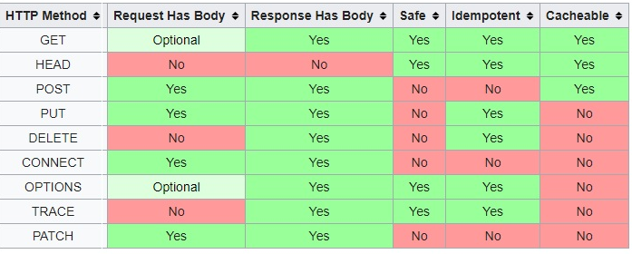

Http Request Method
-

---

- Http는 요청 메서드를 정의하여, 주어진 리소스에 수행하길 원하는 행동을 나타냄
- 클라이언트가 웹 서버에게 요청하는 목적 및 종류를 알리는 수단

```
GET /dir/page.html HTTP/1.1
```

<br/><br/>


Method 종류
-

---



### GET

- 웹 서버 측에 특정 리소스를 요청
- 오직 데이터를 읽기만 함 - 안전하다
- body없이 url형식으로(+queryparameter) 요청

<br/>

### HEAD

- 실제 문서를 요청하는 것이 아니라, 문서의 정보를 요청함
- GET메서드의 요청과 동일한 응답을 요구하지만, body를 포함하지 않음
- 응답메시지에는 body없이 Http 헤더 정보만 보냄

<br/>

### POST

- 특정 리소스에 정보를 전송하기 위한 메서드
- 신규 리소스 생성, 클라이언트에 입력된 데이터를 처리하는 프로세스를 실행하기 위해 주로 사용
- 요청 body를 가질 수 있음 
  - 바디에 있는 데이터의 구체적인 유형을 지정가능 (`Content-Type: application/json`)

<br/>

### PUT

- 목적 리소스의 모든 현재 표시를 요청 payload로 바꿈
- 클라이언트에서 서버로 데이터를 보내고, 서버는 해당 데이터를 이용하여 새로운 리소스를 만들거나 기존의 리소스를 교체
- 요청 body를 가질 수 있음

<br/>

### Delete

- 특정 리소스를 삭제

<br/>

### OPTIONS
```
Allow: GET,POST,HEAD
```

- 목적 리소스의 통신을 설정할 때 쓰임
- 웹서버측 제공 메소드 옵션에 대한 정보를 요청한다
- 주로 브라우저의 교차 출처 리소스 공유(CORS), 주로 browser의 js가 보내는 fetch, Axios 요청의 preflight 에서 사용

<br/>

### PATCH
- 리소스의 일부분을 수정요청
- 클라이언트에서 서버로 데이터를 보내고, 서버에서는 그 데이터를 사용해서 리소스의 일부를 업데이트하도록 요청

<br/>

### CONNECT (거의 사용 x)

- 목적 리소스로 식별되는 서버로의 터널을 맺음
- 프록시 서버와 같은 중간 서버 경유
- 프록시 용도로 사용되는 다른 서버로 연결되는 터널을 요청

<br/>

### TRACE (거의 사용 x)

- 목적 리소스의 경로를 따라 메시지 loop-back 테스트를 위해 사용
- Request 리소스가 수신되는 경로를 보기 위해 사용한다
- 클라이언트에서 전송한 메시지를 그대로 되돌려주는 에코를 요청함
- 일반적으로 프록시 서버나 CDN 등을 거치면서 메시지의 변경 여부를 확인하기 위해 사용

<br/>

### +)
보안상 이유로 대부분의 웹서버는 GET, POST, (OPTIONS) 3개 만을 허용하는 경우가 일반적이다
<br/><br/>

PUT vs PATCH
---

---

### Put`
- 요청한 URI에 payload에 있는 자원으로` 대체 요청
- 자원 존재 x: post와 같은 동작방식, 새로운 자원을 만들어 201 응답
- 자원 존재 o: 새로운 자원을 만들어 기존꺼를 대체
  - payload만으로 자원의 전체 상태를 나타내야함
  - 그렇지 않다면 대체했을 때 일부 entity의 field 값이 null로 변경가능
- 멱등성을 지킨다

<br/>

### Patch
- 자원에 대한 부분적인 수정 요청
- 대체가 아닌 부분수정
- 멱등성을 지키지 못한다

<br/>
HTTP메서드는 규약일 뿐 특정 행동을 강제할 수 없지만, 클라이언트와 서버 간의 통신에서 혼란이 발생하지 않도록 정의를 잘 알고 사용하는 것이 좋다

<br/><br/>

References
---

---
1. mdn web docs - HTTP 요청 메서드
   https://developer.mozilla.org/ko/docs/Web/HTTP/Methods
2. RFC 9110 HTTP Semantics
   https://www.rfc-editor.org/rfc/rfc9110
3. 정보통신기술용어해설
   http://www.ktword.co.kr/test/view/view.php?no=3791
4. 요즘IT - HTTP의 새로운 메서드, 서치에 대하여
   https://yozm.wishket.com/magazine/detail/694/
5. 테코블 - 자원을 수정하는 HTTP 메서드 - PUT vs PATCH
   https://tecoble.techcourse.co.kr/post/2020-08-17-put-vs-patch/

