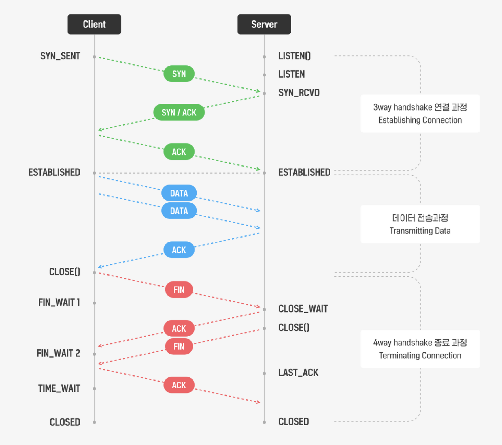
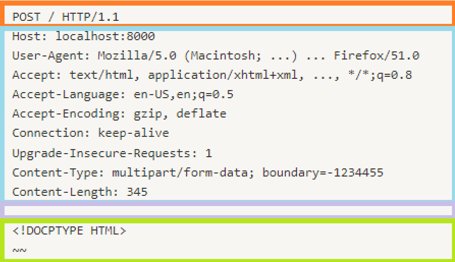

# 웹요청 응답 과정

 

## 웹은 인터넷이 아니다

인터넷

- 다양한 형태의 컴퓨터 네트워크를 서로 연결 지어주는 범지구적 네트워크
- 컴퓨터 네트워크들의 네트워크
- 구축된 인터넷 위에 다양한 서비스들이 동작함
- 네트워크 인프라 ㅇㅇ

웹

- 인터넷 위에서 동작하는 서비스들 중 하나

 

## TCP와 UDP

- TCP와 UDP는 웹 요청과 응답을 이루고 있는 약속
- TCP
    - 전화의 특징
    - 일대일 연결만 가능
    - 손실되면 재전송 요청함
    - 데이터 순서와 무결성이 보장됨 → 신뢰도가 높음
    - 속도가 상대적으로 느림
    - 높은 신뢰도를 요하는 서비스에 적합
- UDP
    - 라디오의 특징
    - 일대다 연결도 가능
    - 정보를 받았는지 확인하지 않고 일방적으로 보냄
        - 데이터 순서와 무결성 보장 x
    - 속도가 상대적으로 빠름
    - IPTV, 스트리밍 서비스에 적합

 

- 출처: [https://velog.io/@dongind/TCP와-HTTP-그리고-웹소켓](https://velog.io/@dongind/TCP%EC%99%80-HTTP-%EA%B7%B8%EB%A6%AC%EA%B3%A0-%EC%9B%B9%EC%86%8C%EC%BC%93)

- 데이터를 주고받는 단위 = 패킷

 

## HTTP

- HyperText Transfer Protocol
- TCP/IP 위에서 전송하는 데이터 규격에 대한 약속
- 요청응답 과정
    1. 사용자가 브라우저에서 URL 입력
    2. 브라우저가 요청메시지 보냄
    3. 서버가 URL을 프로그램 또는 정적 파일로 연결
    4. 서버가 응답 메시지 반환
    5. 브라우저가 응답을 형식에 맞춰 표시함

 

## HTTP의 특징

- 특징
    - 비연결성
    - 단방향성
    - 무상태성

- 비연결성
    - 클라이언트 요청에 대해 서버가 응답을 마치면 연결을 끊어버림
    - 다음 요청은 새로운 연결을 통해 이루어짐
    - 매번 모든 요청에 대해 새로운 연결/해제 과정을 거치므로 네트워크 비용측면에서 비효율적일 수 있음
    - 보완책: HTTP/1.1 Keep-alive
        - 서버와 특정 클라이언트 사이에서 통신이 없어도 지정된 시간동안 연결 유지 가능 추가함
- 무상태성
    - 서버와 클라이언트는 하나의 요청이 진행되는 동안만 서로를 인지함
    - 클라이언트 인증이 필요한 서비스에서 불편함
    - 쿠키, 세션, 토큰

 

## HTTP 요청

- HTTP Request와 HTTP Response는 4가지영역으로 나뉨
    - startline
    - HTTP headers
    - empty line
    - body

 

## Rest API

- 제약조건
1. 클라이언트-서버 (기능이 완벽히 분리되어야함)
2. 무상태
3. 캐시 처리 가능 (쿠키를 이용, 서버부담을 줄임)
4. 계층화 (서버와 클라이언트 사이에 캐시 서버나 로드 밸런서 등의 중간 서버를 둘 수 있음/ 클라이언트는 서버에 직접 연결되었는지, 중간 서버에 연결되었는지 알 수 없음)
5. Code on demand (서버는 클라이언트가 직접 실행시킬 수 있는 로직을 전송할 수 있다)
6. 인터페이스 일관성
    - 각각의 요청은 URI 등으로 식별됨
    - 클라이언트는 서버로부터 전송받아 가지고 있는 정보만으로 리소스를 변경하거나 삭제할 수 있다
    - 각 요청은 처리방법에 대한 충분한 정보를 담고있다
    - 해당 리소스에 대해 할 수 있는 모든 동작에 대한 URI를 제공한다(HATEOAS)

 

## 브라우저란

- 웹 서버에서 이동하며 쌍방향으로 통신하고 HTML문서나 파일을 출력하는 그래픽 사용자 인터페이스 기반의 응용 소프트웨어
    - 웹 브라우저는 대표적인 HTTP 사용자 에이전트의 하나
    - 웹 서버에 원하는 정보를 요청하고 응답 받아 사용자에게 보여주는 역할을 함
- 브라우저는 URL을 통해 웹서버에 자원을 요청한다
    - 브라우저는 URL을 해석하여 HttpRequest를 생성하여 서버에 요청을 보낸다
    - HTTP method는 URL로 특정한 자원을 어떻게 처리할 것인지 정의함
- 받은 응답의 형식을 파악하여 화면에 내용을 표시한다

 

## 웹 브라우저에 URL을 입력하면 일어나는 일

### 티스토리 홈페이지 들어가기

1. 홈페이지 주소 치고 앤터
    - 요청 응답 오감
2. URL을 친다
    - 네트워크 상에서 자원의 위치를 나타냄
    - 프로토콜/ 도메인/ 원하는 리소스가 도메인 내에서 위치한 경로
3. 브라우저가 행위를 해석, HTTP request를 서버로 보냄
    - GET, POST 등 메서드 사용
    - reqeust header 도 같이 보냄/ 필요한 다양한 정보 담김
4. 서버는 요청을 받고 처리
    - header확인
    - 요청에 상응하는 로직 수행
    - 해당하는 html파일 찾고 요청에 대한 응답 생성
5. Http Response를 클라이언트에게 보냄
6. 클라이언트는 HTML파일을 파싱한 후, 필요한 리소스들을 추가 요청 및 응답 받음
    - 브라우저가 추가적인 리소스 요청을 알아서 보냄

 

### 네트워크 관점

1. 브라우저 주소창에 주소를 URL의 형태로 입력한다
2. 상대 서버의 ip주소를 얻기 위해 DNS에 질의
    - 브라우저가 OS에 요청
    - OS는 Resolver를 통해 DNS 서버로 요청
    - 계층적 탐색과정을 거쳐 IP주소를 얻어옴
3. IP주소를 획득하여 서버쪽으로 tcp연결을 수행
    - ARP를 통해 웹서버의 물리주소를 얻은 후 수행
    - 3 way handshake
4. Http Request를 보냄
5. Http Response를 받음
6. 브라우저는 화면에 내용을 표시함

 

- Application Layer에서 Http Request메시지를 생성
- Tranport Layer에서 Http 요청을 TCP 세그먼트로 래핑한다. (소스 포트, 목적지 포트 포함)
- Internet Layer에서 소스 IP주소와 목적지 IP주소를 패킷에 추가한다
    - 공유기 사용 시 Private IP를 NAT변환하는 과정을 거친다
- Physical Layer에서 비트를 전기신호로 변환

 

## 참고자료

[https://www.youtube.com/watch?v=xz7e-GL2g6g&ab_channel=우아한테크](https://www.youtube.com/watch?v=xz7e-GL2g6g&ab_channel=%EC%9A%B0%EC%95%84%ED%95%9C%ED%85%8C%ED%81%AC)

[https://www.youtube.com/watch?v=4SaW9BbtL3k&ab_channel=우아한테크](https://www.youtube.com/watch?v=4SaW9BbtL3k&ab_channel=%EC%9A%B0%EC%95%84%ED%95%9C%ED%85%8C%ED%81%AC)

[https://www.youtube.com/watch?v=0jV7xOUcKog](https://www.youtube.com/watch?v=0jV7xOUcKog)