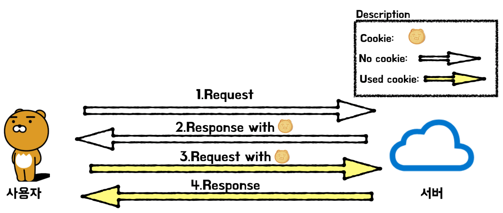

## Cookie & Session

## 쿠키 & 세션 사용 이유

HTTP 프로토콜 환경의 connectionless, stateless한 특성상 서버는 클라이언트가 누구인지 매번 확인해야함.(웹 사이트 돌아다닐 때마다 로그인을 해야할 수도 있다는 뜻) 사용자의 정보를 저장해 이러한 특성을 보완하기 위해 쿠키와 세션을 사용함.

- connectionless : 클라이언트가 요청을 한 후 응답을 받으면 그 연결을 끊어 버리는 특징
- stateless : 통신이 끝나면 상태를 유지하지 않는 특징

## 쿠키?

- 쿠키는 클라이언트(브라우저) 로컬에 저장되는 키와 값이 들어있는 작은 데이터 파일.

### 쿠키 구성요소

- 이름 : 각각의 쿠키를 구별하는 데 사용되는 이름
- 값 : 쿠키의 이름과 관련된 값
- 유효시간 : 쿠키의 유지시간
- 도메인 : 쿠키를 전송할 도메인
- 경로 : 쿠키를 전송할 요청 경로

### 쿠키 동작 방식

1. 클라이언트가 페이지를 요청
2. 서버에서 쿠키를 생성
3. HTTP 헤더에 쿠키를 포함 시켜 응답
4. 브라우저가 종료되어도 쿠키 만료 기간이 있다면 클라이언트에서 보관하고 있음
5. 같은 요청을 할 경우 HTTP 헤더에 쿠키를 함께 보냄
6. 서버에서 쿠키를 읽어 이전 상태 정보를 변경 할 필요가 있을 때 쿠키를 업데이트 하여 변경된 쿠키를 HTTP 헤더에 포함시켜 응답

### 쿠키 사용 예

- 방문 이력
- 검색 기록
- 로그인 상태

### 쿠키의 단점

- 보안

## 세션?

- 세션은 쿠키를 기반하고 있지만, 사용자 정보 파일을 브라우저에 저장하는 쿠키와 달리 세션은 서버 측에서 관리

- 서버에서는 클라이언트를 구분하기 위해 세션 ID를 부여하며 웹 브라우저가 서버에 접속해서 브라우저를 종료할 때까지 인증상태를 유지함.

### 세션 동작 방식

1. 사용자가 로그인을 시도함.
2. 회원이 맞는지 회원 DB에서 확인합니다.(인증)
3. 사용자의 고유한 ID 값을 부여하여 세션 저장소에 저장함.
4. 그 다음 이와 연결되는 세션 ID 를 발행
5. 생성한 세션 ID를 로그인 요청에 대한 HTTP 응답 헤더에 담아 클라이언트로 전송
6. 클라이언트는 서버에서 세션 ID 를 받아 쿠키에 저장
7. 인증이 필요한 요청마다 쿠키를 HTTP 요청 헤더에 담아서 서버에 전송
8. 서버는 받은 쿠키(세션 ID)를 검증
9. 서버는 검증이 완료되면, 사용자에 맞는 데이터(유저 정보)를 내려다 줌.

=> 쿠키를 세션ID를 전달하는 매개체로 사용

### 세션 사용 예

- 강제 로그아웃
- 넷플릭스 계정공유 숫자 제한

### 세션의 장점

- 각 사용자는 고유의 ID 값을 발급받게 되며, 서버는 쿠키 값을 받았을 때 일일이 회원 정보를 확인할 필요 없이 바로 어떤 회원인지를 알 수 있음. 덕분에 서버의 자원에 접근하기 용이함.
- 이 방식은 기본적으로 쿠키를 매개로 인증을 거침. 쿠키는 세션 저장소에 담긴 유저 정보를 얻기 위한 열쇠일 뿐, 쿠키 자체 (세션 ID) 는 유의미한 값을 갖고 있지 않아 안전합니다.
  ⇒ 따라서 요청이 도중에 노출되더라도 중요 정보는 서버 세션에 있기 때문에 위 방식보다는 비교적 안전함.

### 세션의 단점

- 로그인한 모든 유저의 세션ID를 DB에 저장하는 방식으로 많은 DB리소스 필요 => 이러한 문제점 때문에 JWT 등장
- 요청 들어올 때마다 쿠키의 세션ID와 일치하는 사용자를 찾아야하기 때문에 서버의 부하증가

## 정리

|          |                        Cookie                        |     Session      |
| :------: | :--------------------------------------------------: | :--------------: |
| 저장위치 |                        Client                        |      Server      |
| 저장형식 |                         Text                         |      Object      |
| 만료시점 | 쿠키 저장시 설정 (설정 없으면 브라우저 종료 시) | 정확한 시점 모름 |
|  리소스  |                 클라이언트의 리소스                  |  서버의 리소스   |
| 용량제한 |           한 도메인 당 20개, 한 쿠키당 4KB           |     제한없음     |

#### 저장 위치

- 쿠키 : 클라이언트의 웹 브라우저가 지정하는 메모리 or 하드디스크
- 세션 : 서버의 메모리에 저장

#### 만료 시점

- 쿠키 : 저장할 때 expires 속성을 정의해 무효화시키면 삭제될 날짜 정할 수 있음
- 세션 : 클라이언트가 로그아웃하거나, 설정 시간동안 반응이 없으면 무효화 되기 때문에 정확한 시점 알 수 없음

#### 리소스

- 쿠키 : 클라이언트에 저장되고 클라이언트의 메모리를 사용하기 때문에 서버 자원 사용하지 않음
- 세션 : 세션은 서버에 저장되고, 서버 메모리로 로딩 되기 때문에 세션이 생길 때마다 리소스를 차지함

#### 용량 제한

- 쿠키 : 클라이언트도 모르게 접속되는 사이트에 의하여 설정될 수 있기 때문에 쿠키로 인해 문제가 발생하는 걸 막고자 한 도메인당 20개, 하나의 쿠키 당 4KB로 제한해 둠
- 세션 : 클라이언트가 접속하면 서버에 의해 생성되므로 개수나 용량 제한 없음
