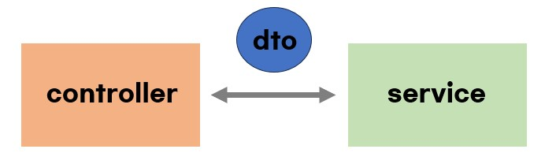

# DTO vs VO

<br/>

# DTO란?

- data transfer object
- 계층간 데이터를 전달하기 위해 사용하는 객체

### DTO의 특징
- 순수하게 데이터를 전달하는 객체
- 오직 getter/setter만 가질 수 있고, 다른 로직은 포함하면 안됨
    - (setter는 지양 -> 불변 객체로 만들기)

<br/><br/>

# VO란?
- value object
- 값 그 자체를 표현하는 객체


### 특징
1. 불변성
    - 생성 시에 값이 초기화되어야한다
2. 자가 유효성 검사
    - getter/setter이외의 로직이 포함가능
    - 항상 유효한 값만이 속성으로 저장됨 -> 안정성 보장
3. 동등성
    - 속성값으로 비교되어야함
    - hashCode()와 equals()를 오버라이딩하여 속성값들로만 비교될 수 있도록 만들어야함

### VO 사용예시
1. 돈은 각자 고유번호가 있지만 같은 만원이라고 표현함
    - 값 그 자체를 나타냄
    - 값으로 비교됨
2. 나이를 저장
    - 마이너스 값이 들어가면 안됨
    - 생성 시 자가 유효성 검사를 통해 유효한 값만 저장될 수 있도록 처리
3. x,y 2차원 좌표값
    - 유효한 값이 들어갈 수 있도록 처리
4. 일급 컬렉션
    - 일급컬렉션도 VO의 일종으로 볼 수 있음
    - 컬렉션을 속성으로 가지는 클래스를 만들어 자가유효성을 검사함

```
규칙 8: 일급 콜렉션 사용
이 규칙의 적용은 간단하다.
콜렉션을 포함한 클래스는 반드시 다른 멤버 변수가 없어야 한다.
각 콜렉션은 그 자체로 포장돼 있으므로 이제 콜렉션과 관련된 동작은 근거지가 마련된셈이다.
필터가 이 새 클래스의 일부가 됨을 알 수 있다.
필터는 또한 스스로 함수 객체가 될 수 있다.
또한 새 클래스는 두 그룹을 같이 묶는다든가 그룹의 각 원소에 규칙을 적용하는 등의 동작을 처리할 수 있다.
이는 인스턴스 변수에 대한 규칙의 확실한 확장이지만 그 자체를 위해서도 중요하다.
콜렉션은 실로 매우 유용한 원시 타입이다.
많은 동작이 있지만 후임 프로그래머나 유지보수 담당자에 의미적 의도나 단초는 거의 없다.
```


<br/><br/>

# DTO vs VO

- 값으로 비교
    - DTO는 속성값이 모두 같다고 해서 같은 객체가 아님
    - VO는 <u>**속성값이 같으면 같은 것으로 취급**</u>
- getter/setter 외의 로직을 가질 수 있는지 여부
    - DTO는 속성값 세팅 외의 로직을 가질 수 없음
    - VO는 자가 유효성 검사 등 속성값 세팅 외의 로직을 가질 수 있다

<br/><br/>
# 참고자료

1. https://www.youtube.com/watch?v=z5fUkck_RZM&t=129s
2. https://www.youtube.com/watch?v=EeJnNaiMy3U
3. https://hudi.blog/value-object/