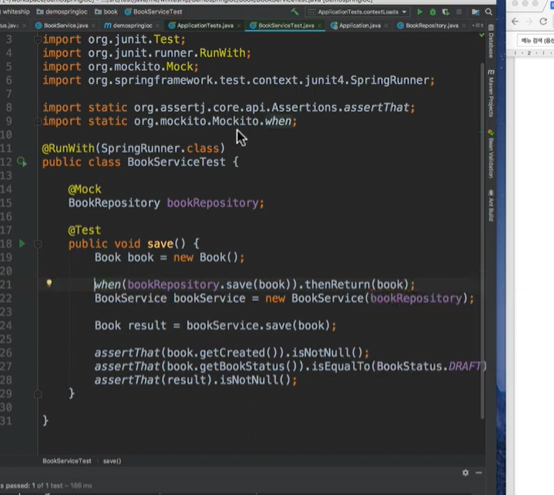

# Spring IoC/ DI

<br/>

# Spring의 대 삼각형

- 삼각형
    - IoC/DI
    - AOP
    - PSA
- POJO는 IoC/DI, AOP, PSA를 통해 달성할 수 있다
    - java로 생성하는 순수한 객체
    - 객체 지향적인 원리에 충실하면서 환경과 기술에 종속되지 않고, 필요에 따라 재활용될 수 있는 방식으로 설계된 오브젝트
- POJO 프로그래밍: POJO에 애플리케이션의 핵심 로직과 기능을 담아 설계하고 개발하는 방법

- (POJO 프로그래밍 원칙)
    1. java나 java스펙에 정의된 것 이외에는 다른 기술이나 규약에 얽매이지 않아야한다
        - 기술을 상속받아 코드 작성 → 요구사항이 변경되어 다른 기술로 변경해야할 때 모두 제거하고 수정해야함
    2. 특정 환경에 종속적이지 않아야 한다
        - 특정 프레임워크에서만 동작이 가능하면 안됨
        - 다른 서블릿 컨테이너 사용 시 모두 수정해야할 수 있음
    - spring은 POJO프로그래밍을 지향하는 프레임워크
        - IoC/DI, AOP, PSA를 지원함

<br/>

### 의존한다

- A가 B에 의존한다
- B가 변경되면 A도 변경된다
- A → B

<br/><br/>

# DI(Dependency Injection)

- 메인 모듈이 직접 다른 하위 모듈에 대한 의존성을 주기보다, 중간에 의존성 주입자를 두어 얘가 이 부분을 가로채 메인모듈이 간접적으로 의존성을 주입할 수 있게 해주는 태크닉(다지인패턴)
    - 의존하고 있는 객체를 외부에서 결정하고 이를 주입받는 것
    - 사용할 객체를 직접 만들어 쓰지 않고 어떤 장치를 사용해 주입받아 사용하는 것
- 토비의 스프링에서 말하는 의존관계 주입의 충족해야하는 조건
    - *클래스 모델이나 코드에는 런타임 시점의 의존관계가 드러나지 않는다. 그러기 위해서는 인터페이스만 의존하고 있어야 한다.*
    - *런타임 시점의 의존관계는 컨테이너나 팩토리 같은 제3의 존재가 결정한다.*
    - *의존관계는 사용할 오브젝트에 대한 레퍼런스를 외부에서 제공(주입)해줌으로써 만들어진다*
- 스프링이 없어도 장치만 있다면 ㅇㅇ 얼마든지 사용가능
    - 테스트할 때 만들어서 ㅇㅇ 주입해서 사용도 가능함

<br/>

### DI의 장점

- 유연하고 확장성이 뛰어난 코드를 만들 수 있게 해줌
- 단위 테스팅과 마이그레이션이 쉬워진다(DB이동, 데이터 이동 등)
- 애플리케이션 의존성 방향이 좀 더 일관되어 코드를 추론하기 쉬워짐

<br/>

### DI를 통해 할 수 있는 일

- 관심사 분리
    - 객체를 생성하고 생성한 객체의 인스턴스를 사용하는 로직 분리 → 코드의 가독성과 재사용성 높여줌
- Interface를 통한 DI 구현한다면
    - 느슨한 의존성 주입 구현가능(객체가 구현체이 의존 x 다형성 향상 가능)
    - 모듈 사이에 인터페이스를 두어 서로의 의존관계 제거, 런타임 환경에서 서로의 관계를 동적으로 주입 가능
    - 결합도가 낮아지고 유연성을 높일 수 있음
    - 재사용성 높은 코드/ 테스트하기 좋은 코드/ 가독성

<br/>

### 의존성을 주입하는 3가지 방법

- DI를 구현하는 방법

```java
class 햄버거 {
	Bread bread;
	Patty patty;
	
	public 햄버거(Bread bread, Patty patty) {
		this.bread = bread;
		this.patty = patty;
	}
}
```

1. 생성자를 통한 주입
    - 생성자 호출 시 외부에서 bread, patty 의존성을 주입받음
2. Setter 메서드를 통한 주입
    - setter를 통해 의존성 주입받음
3. Interface를 통한 주입
    - interface를 통해 의존성을 주입
    - 의존성 주입하는 메서드를 포함하는 인터페이스를 작성, 구현체를 통해 실행 시점에 의존성을 주입받음

```java
interface 햄버거 {
	void 내용물(Bread bread, Patty patty);
}

class 데리버거 implements 햄버거 {
	Bread bread;
	Patty patty;
	
	@Override
	public void 내용물(Bread bread, Patty patty) {
		this.bread = bread;
		this.patty = patty;
	}
}
```

- 의존성을 빠뜨릴 수 있는 setter 주입과 달리 @ Override로 메서드 구현을 강제할 수 있다

<br/>

# IoC

<aside>
💡 객체를 관리할 수 있는 제어권을 개발자가 아닌 다른 것(Spring)이 가지게 하는 것

</aside>

- 의존관계역전원칙Spring은 객체를 생성하고 싱글톤으로 관리하고 전달해주는 역할을 함

<br/>

### 의존관계 역전 원칙

- 상위 모듈은 하위 모듈에 의존해서는 안됨. 둘 다 추상화에 의존해야 함
- 추상화는 세부사항에 의존해서는 안됨. 세부 사항은 추상화에 따라 달라져야함

<br/><br/>

# 전략패턴

```java
public class Car {
	private MovingStrategy movingStrategy;
	private int distance;
	
	public Car(MovingStrategy movingStrategy) {
		this.movingStrategy = movingStrategy;
		this.distance = 0;
	}
	
	void move() {
		if (movingStrategy.isMovabale()) {
			distance++;
		}
	}
}
```

- 관심사 분리를 위한 인터페이스 적용
    - 자동차 수정 ㄴㄴ 움직임만 수정이 가능
- 자동차 객체는 자신의 전략을 스스로 결정할 수 없음
    - 자기도 어떤 걸로 동작할지 몰라
    - 제어의 주도권이 자동차 스스로에게 없다
- 제어권은 객체를 사용하는 쪽 → 클라이언트

<br/>

```java
public class Racing {
	private static final int NUM_OF_CARS = 10;
	private List<Car> cars = new ArraysList<>();
	
	public Racing() {
		MovingStrategy strategy = new RandomMovingStrategy();
		
		for (int i=0; i<NUM_OF_CARS; i++) {
			cars.add(new Car(strategy));
		}
	}
	
	public void move() {
		cars.forEach(Car::move);
	}
}
```

- 모든 객체에 대한 제어를 다 함
- 전략 생성 및 행동도 제어함
- 관심사 분리 적절 ㄴㄴ 책임은 레이싱이지 자동차 생성이 아냐
    - 자동차 생성 책임 관심사가 섞임

<br/><br/>

# 제어의 2가지 관점

- Car **생성에 대한 제어**
    - 어떤 연고나관계를 맺으며 생성될 것인가? - factory 패턴
- Car **행동 제어**
    - 어떻게 사용될 것인가

```java
public class CarFactory {
	public static Car getCar() {
		return new Car(movingStrategy());
	}
	
	private static MovingStrategy movingStrategy() {
		return new RandomMovingStrategy();
	}
}

public class Racing {
	private static final int NUM_OF_CARS = 10;
	private List<Car> cars = new ArraysList<>();
	
	public Racing() {
		MovingStrategy strategy = new RandomMovingStrategy();
		
		for (int i=0; i<NUM_OF_CARS; i++) {
			cars.add(factory.car());
		}
	}
	
	public void move() {
		cars.forEach(Car::move);
	}
}
```

- 적절한 관심사 분리

생성에 대한 관심사 → bean 컨테이너 역할

어떻게 사용 → 스프링 내부 코드

- controoler 어캐하고~

구현체를 구현하는건 우리

어캐 생성/ 연관고나계 → 빈컨테이너가 다 해줌

컨토ㅡ롤라 서비스 호출 동작 이런 코드 작성해본 적없어

내부적인 클라어언트 코드가 다 담당해줌

- 관심사의 분리를 통해 유연하고 확장성이 쉬운 코드를 만들다보니 자연스럽게 만들어진 프로그래밍 모델

<br/><br/>

# IoC 컨테이너

### 스프링 IoC 컨테이너

- BeanFactory 클래스
    - 애플리케이션 컴포넌트의 중앙 저장소
    - ApplicationContext는 BeanFactory를 상속받아 만든 것

- 스프링 IoC 컨테이너 안 객체들은 빈
    - 빈들을 컨테이너로서 가져와 사용가능
- 컨테이너 + 빈 설계
    - 초기에는 xml설정이 대세
    - 그 뒤에는 어노테이션 기반 di 사용하기 시작
- 빈으로 등록해서 / 등록된 빈을 autowired로 손쉽게 주입받아 사용가능
    - IoC 컨테이너 최상위 인터페이스 = BeanFactory
        - 다양한 구현체가 있음
        - IoC 컨테이너의 가장 기본적인 클래스
        - Bean factory lifecycle 인터페이스들 있음
    - 다양 라이프이클 통해 여러 기능 제공가능

- 의존성 주입 받으려면 bean으로 들어가있어야 받을 수 있어

bean은 app전반적으로 ㅇㅇ 오직 하나만 사용되어야함

- IoC 컨테이너에서는 싱글톤 scope으로 빈으로 관리됨
- 프로토타입 = 싱글톤이 아닌 것
    - 매번 다른 객체사용 = 프로토타입

IoC로부터 받아서 사용한다면 = 인스턴스들은 항상 같은 객체!

- 메모리면에서도 효율적/ 미리 만들어둔거 사용
- 런타임 시 성능최적화에도 개이득
    - repository 객 체들 만들 때 비용이 비싸다. 디비 연관되어야하자나
    - 의존성관리 ㅇㅇ 가능 !! 장점
    - 라이프사이클 인터페이스를 지원해줌 →
        - 스프링 IoC 컨테이너에 등록된 빈에 국한된 이야기임
        - 빈 만들어졌을 대 추가적인 작업을 하고싶다면 ??
        - @PostConstruct() : 빈 만들어졋을 때 뭐 하고싶다~ 메서드 위에 붙임
        - 빈이 만들어지자마자 라이프사이클 붙어있는 애들 ㅇㅇ 호출 됨
        - 다양한 라이프사이클 인터페이스 사용, 부가적작업 가능
        - 스프링 자체에서 라이프사이클 콜백 사용, 부가적인 기능 사용가능함

- 의존성을 가진 service의 단위테스트를 만들기 힘듦
    - service코드~ bookrepository 바로 생성 시 → 의존성 주입안되면 테스트 너무 힘들어
    - 우리는 의존성주입 가능하게 코드 만들었으니 ㅇㅇ 가짜 객체를 만들어서 주입 가능 ㅇㅇ Mock



<br/><br/>

# Spring 에서 의존성 주입 방법(IoC + DI)

### 의존성 자동 주입 @Autowired

```java
@Controller
public class BurgerController {
	@Autowired
	private BurgerService burgerService;
}
```

<br/>

### ✅ @SpringBootApplication을 통한 의존성 자동 주입

`@SpringBootApplication` 어노테이션을 살펴보면, `@ComponentScan`가 존재함을 알 수 있는데, 

`@ComponentScan`는 `@Component`가 부여된 클래스들을 탐색하여 Spring의 빈으로 등록해준다. 

- `@Controller`, `@Service`, `@Repository`은 `@Component`를 적절한 목적에 따라 명시하기 위한 어노테이션
- ComponentScan이 @Component를 가지는 클래스들을 스캔하면서 controller도 빈으로 등록해줌

<br/>

### @Autowired 의존성 주입방법 3가지

1. 필드주입
2. setter주입
3. 생성자 주입

```java
@Controller
public class BurgerController {
	@Autowired
	private BurgerService burgerService;
}
```

- 필드주입 지양해야함
    - Spring은 필드주입을 권장하지 않음
    - 수동으로 의존성을 주입해야하는 테스트의 경우 생성자나 Setter메서드로 존재하지 않아서 직접 의존성을 주입할 수 없음
    - 필드주입 → 객체 간의 의존성이 프레임워크에 강하게 종속되는 문제점

<br/>

```java
@Controller
public class BurgerController {
	private BurgerService burgerService;
    
    @Autowired
    public void setBurgerService(BurgerService burgerService) {
    	this.burgerService = burgerService;
    }
}
```

> Setter 주입을 사용할 경우 빈 생성자 또는 빈 정적 팩토리 메서드가 필요하다. 또한, final 필드를 만들 수 없고 의존성의 불변을 보장할 수 없다.
> 

그렇다면 Setter 주입 방식을 사용하면 안될 것 같은데 Setter 주입 방식을 사용하는 이유가 있을까?

> Setter 주입 방식의 경우 불변 보장이 안된다는 점을 보면, 런타임 환경에서 Setter 메소드를 호출하면 이미 주입했던 의존성을 변경할 수가 있게 된다. 그래서 런타임 환경에서 의존성을 변경하거나 선택적으로 의존성을 주입해야 할 경우 사용될 수 있다.

<br/>

### 생성자 주입

```java
@Controller
public class BurgerController {
	private final BurgerService burgerService;
    
    public BurgerController(BurgerService burgerService) {
    	this.burgerService = burgerService;
    }

```

위와 같이 생성자 주입 방식을 이용하면 **객체가 최초로 생성될 시점에 Spring이 자동으로 의존성을 주입**해준다.

이러한 생성자 주입 방식은 Spring에서 공식적으로 적극적으로 권장하고 있다.

> 💡 생성자 주입시 @Autowired 어노테이션가 없는 이유?
> 
> 
> Spring 4.3 이후부터 생**성자가 한 개만 있다면 해당 생성자에 Spring이 자동으로 `@Autowired` 어노테이션을 붙여주기 때문**에 생성자가 하나일 경우 생략해도 무방하다.
> 
> ```java
> @RequiredArgsConstructor
> @Controller
> public class BurgerController {
>     private final BurgerService burgerService;
> ```
> 
> 또한, 위와 같이 Lombok 의 `@RequiredArgsConstructor` 어노테이션까지 활용한다면 간단한 코드 작성만으로 생성자 주입을 활용하여 의존성 주입을 할 수 있다.

<br/>

### 생성자 주입을 사용해야하는 이유

- 생성자 주입과 Setter 주입 중 선택하여 의존성을 주입할 수 있지만, 기본적으로는 생성자 주입을 추천한다
- 생성자 주입된 컴포넌트들은 초기화된 상태로 클라이언트에 반환되기 때문에 생성자 주입을 권장함
- Setter 주입은 주로 클래스 내에서 기본 값을 할당할 수 있는 선택적 의존성을 주입할 때만 사용해야 함

**1. 객체의 불변성 확보**,

- 필드를 final 키워드로 만들 수 있기 때문에 의존성 주입이 생성자 호출시 최초 1회만 이루어지기 때문에 의존관계를 불변으로 만들어 줄 수 있다.

**2. NullPointerException 방지**

- 생성자 주입이 아닌 필드 주입이나 Setter 주입은 new 키워드로 객체를 생성할 때, NullPointerExceptiondl 발생할 수 있다. 하지만 생성자 주입은 객체 생성 시점에 모든 의존성을 주입해주기 때문에 Null으르 의도적으로 삽입하지 않는 한 NullPointerException이 발생할 수 없다.

**3. 순환 참조 방지**

- 생성자 주입을 사용하면 Spring을 통해 **애플리케이션의 시작되는 시점(객체의 생성 시점)에 순환 참조 에러를 예방**할 수 있다.
- 서로 다른 두 객체가 서로를 의존하고 있을 경우 서로를 계속 호출하게 되어 `StackOverflow` 에러가 발생하게 되는데, 생성자 주입을 통해 의존하고 있는 객체가 순환 참조가 일어나게 되면 Bean에 등록하기 위해 객체를 생성하는 과정에서 다음과 같이 순환 참조가 발생하기 때문에 애플리케이션 구동 시점에 에러를 통해서 문제를 방지할 수 있다.

Spring Boot 2.6 버전 이상부터는 필드 주입이나 Setter 주입도 기본으로 순환 참조 문제를 방지할 수 있다고 한다.

<br/>

---

# DI는 IoC를 사용하지 않아도 된다

- IoC가 없는 DI도 큰 장점을 가진다

```java
public class PizzaStore
{
    private readonly Pizza[] pizzas =
        new Pizza[]
        { 
            new Pizza(),
            new Pizza(),
            new Pizza()
        };

    public void Sell(int count)
    {
        // pizzas 필드를 사용해 피자를 판매한다.
        ...
    }
}
```

- 피자를 더 팔고싶다면 클래스를 수정해야함 → OCP 위반
    - PizzaStore가 pizza를 직접 참조하기 때문에 발생
    - 필요한만큼 pizza 배열을 인수로 취하면 해결됨
        - 인수를 취하는 것이 DI의 개념의 대부분이다
    - [Rúnar Bjarnason는 한 세미나에서 다음과 같이 DI는 인수를 취하는 것을 허세적으로 표현한 것에 지나지 않는다고 했다.](https://www.youtube.com/watch?v=ZasXwtTRkio)
        - 추상화를 해치지 않고 의존성을 인수로 넘겨주는 방법이 DI다

<br/>

```java
public interface IPizzaStore
{
    void Sell(int count);
}
```

- 인터페이스 도입
- PizzaStore는 이 인터페이스를 구현
    - 인수로 넘겨지지만, 인터페이스는 그 정보 담고있지 않음
- 추상화를 해치지 않고 의존성을 인수로 넘겨주는 방법 = DI

<br/>

### DIP: dependency Inversion Principle

- 여러 종류의 피자를 팔 수 없는 코드
    - PizzeStore가 Pizze타입에 의존하고 있기 때문 → DIP 위반
    - **중요한 클래스가 덜 중요한 클래스에 의존하면 DIP 위반**
- IPizza인터페이스를 도입해 DIP문제 해결해보자
    - 인터페이스에 의존하게 만들면 화상표방향이 역전함 → DIP 원칙 지킬 수 있다


- 이제 다양한 종류의 피자를 생성자로 넘겨줄 수 있음

- DIP 원칙
    - A. 상위 수준 모듈은 하위 수준 모듈에 의존해서는 안 됩니다. 둘 다 추상화에 의존해야 함
    - B. 추상화는 세부사항에 의존해서는 안 됩니다. 세부 사항은 추상화에 따라 달라짐
        - 추상화 타입의 멤버필드, 메서드 반환 값 or 인자가 구체타입으로 표현되면 안됨

<br/>

### **DI를 사용하면서 DIP가 필요없는 경우도 많음**

```csharp
public interface IUserStore
{
    User Find(string userId);
}

public class CachedUserStore : IUserStore
{
    ...

    public CachedUserStore(IUserStore innerStore, int duration)
    {
        ...
    }

    public User Find(string userId)
    {
        ...
    }
}
```

- 사용자를 일정기간동안 캐시하는 역할을 함
    - 매번 조회 ㄴㄴ
    - duration 값은 DI를 통해 주입되지만, DIP가 필요하진 않음
    - 굳이 인터페이스로 추상화할 필요는 없다

<br/>

### IoC

- IoC는 프레임워크와 라이브러리 사용  차이에서 살펴볼 수 있음
    - 라이브러리 사용 시 필요한 구성요소를 직접 가져와서 쓰면 됨
    - 프레임워크는 규칙에 따라 구성요소 등록 → 프레임워크에서 이 구성요소를 가져다 쓰게 됨
        - 제어가 역전되었다
        - 팩토리 메소드/ 템플릿 메소드 패턴도 IoC를 설명하는 좋은 예가 됨

```csharp
public static void Main()
{
    var pizzaStore = new PizzaStore(
        new IPizza[]{
            new CheezePizza(),
            new CheezePizza(),
            ...
            new ShrimpPizza(),
            new BulgogiPizza(),
            ...
        });

    ...
}
```

- 피자 종류가 아주 많다면
    - 이 작업을 프레임워크가 해주면 좋지
    - IoC 컨테이너가 해줌!
    - 특정 모듈에 속하는 모든 구현타입을 IoC컨테이너로 등록하는 것을 보여줌
    - “필요하면 내가 연락할게” - 헐리우드 원칙

```csharp
public static void Main()
{
    Type[] pizzaTypes = Assembly.GetEntryAssembly()
        .GetExportedTypes()
        .Where(typeof(IPizza).IsAssignableFrom);

    var builder = new IoCContainerBuilder();
    buildr.RegisterTypes(pizzaTypes);

    IoCContainer container = builder.Build();

    IPizza[] allKindsOfPizzas = container.Resolve<IPizza[]>();

    var pizzaStore = new PizzaStore(allKindsOfPizzas);

    ...
}
```

- 특정 타입 피자 클래스 생성자는 사용자에 의해 직접 호출 x IoC 컨테이너에 의해 호출됨
    - 인스턴스 생성 방향이 역전됨

<br/>

### DI를 사용한다고 IoC 컨테이너가 무조건 필요한 것은 아니다

- 사용자가 직접 생성해서 주입해줄 수도 있자나
    - 얼마든지 생성자에 내가 만들어서 인수 넘겨줄 수 있음
- Mark Seemann은 IoC컨테이너를 사용하지 않는 DI = Pure DI라고 말함
    - IoC 컨테이너를 사용하면 의존성등록 비용이 적지만
    - IoC 컨테이너를 배우고 익혀야함
    - 의존성이 잘못 구성될 경우 컴파일 에러가 아닌 런타임 에러가 발생함
    - **의존성 등록비용을 줄인다는 이유로 IoC 컨테이너 학습비용과 Weakly typed 비용을 고려하지 않는다면 곤란하다.**
    - weakly typed 비용이 의존성 등록비용보다 크다

- IoC 컨테이너의 역할
    - 특정 타입의 클래스 생ㅇ성자는 사용자에의해 직접 호출되는 것이 아니라, IoC 컨테이너에 의해 호출됨

<br/><br/>

## 결론

- DI는 의존성을 어떻게 가질 것인가에 대한 문제다. 직접 의존도 가능하고, 의존성을 SL로 위치시킬 수도 있다. **의존성을 인수로 취하는 것**이 DI의 특징이다. 이때 DI는 추상화를 해치지 않고 의존성을 주입할 수 있는 수단을 제공한다.
- 의존성을 참조하는 **의존자가 만약 의존성보다 중요한 모듈(클래스)이라면**, 이 둘은 **추상화에 의존할 필요가 있다**. 자동차가 타이어를 가지는데 한 종류의 타이어만 사용한다는 것은 상상할 수 없는 일이다. 타이어 크기를 추상화해 크기만 맞으면 어떤 타이어도 사용할 수 있도록 해야 된다. 이것이 DIP다. DIP는 **실체에 의존할 것이가, 추상화에 의존할 것이가**의 문제다.
- IoC는 프로그래밍 전반에서 흔히 접할 수 있는 기법이다. DI와 연관 지어 생각해본다면, 특정 클래스의 생성자를 직접 호출해 인스턴스를 생성하는 방법이 있다. **생성자를 일일이 호출하는 것이 번거롭다면, 이 작업을 프레임워크에 맡길 수 있을 것**이다. IoC는 누가 작업을 수행하냐에 대한 얘기다.
- DI는 IoC사용을 필수로 요구하지 않는다. 의존성 등록비용을 줄인다는 이유로 IoC 컨테이너 학습비용과 Weakly typed 비용을 강요해서는 안된다. Weakly typed 비용은 생각보다 클 수 있다. IoC 컨테이너에 대한 확신이 설 때까지 최대한 사용을 미루고, Pure DI에 귀를 기울일 필요가 있다. Pure DI를 사용하다 생기는 불편함이 IoC 컨테이너 사용에 대한 확신을 주며, 안내서 역할을 해줄 것이다.

<br/><br/>

# AOP

- 관점 지향 프로그래밍(aspect-oriented programming)
- 횡단 관심사(cross-cutting concern)의 분리를 허용함으로써 모듈성을 증가시키는 것이 목적인 프로그래밍 패러다임
    - 핵심 관심사항에만 집중

<br/><br/>

# 참고자료

[https://www.youtube.com/watch?v=_OI9mKuFb7c&t=305s](https://www.youtube.com/watch?v=_OI9mKuFb7c&t=305s)

[https://www.youtube.com/watch?v=nOHdunGzeRc](https://www.youtube.com/watch?v=nOHdunGzeRc)

[https://www.youtube.com/watch?v=QrIp5zc6Bo4](https://www.youtube.com/watch?v=QrIp5zc6Bo4)

[https://www.youtube.com/watch?v=L-0UvbFUXrk](https://www.youtube.com/watch?v=L-0UvbFUXrk)

[https://ittrue.tistory.com/211](https://ittrue.tistory.com/211)

[https://velog.io/@langoustine/Spring-02](https://velog.io/@langoustine/Spring-02)

([https://www.notion.so/2-22bf498b8da34c0cb4ee794649817a37](https://www.notion.so/2-22bf498b8da34c0cb4ee794649817a37?pvs=21))

(노션링크)

[https://tecoble.techcourse.co.kr/post/2021-04-27-dependency-injection/](https://tecoble.techcourse.co.kr/post/2021-04-27-dependency-injection/)

[https://jwchung.github.io/DI는-IoC를-사용하지-않아도-된다](https://jwchung.github.io/DI%EB%8A%94-IoC%EB%A5%BC-%EC%82%AC%EC%9A%A9%ED%95%98%EC%A7%80-%EC%95%8A%EC%95%84%EB%8F%84-%EB%90%9C%EB%8B%A4)