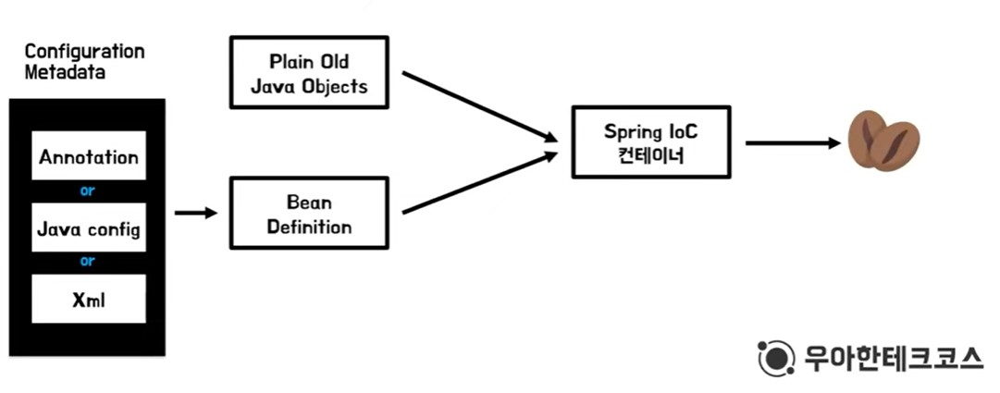
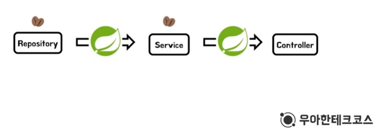

# Spring Bean
- Spring IoC 컨테이너에 의해서 관리되는 객체이다.

## Spring IoC Container
- Bean을 관리하는 객체
- ApplicationContext 인터페이스가 Spring IoC 컨테이너를 대표
- 빈을 인스턴스화하고 구성 및 모으는 책임이 있다.

## Bean과 의존성 주입
```java
//1
Service service = new Service(new Dao());

//2 
Service service = new Service(new DaoA(),new DaoB(),new DaoC());
```
1) 빈을 사용하지 않고 의존성 주입을 한다면, Dao의 구현체가 변경된다면 서비스를 생성하는 곳에서도 변경이 일어난다.
=> 서비스를 생성할 때, Dao를 초기화함과 동시에 어떤 Dao의 구현체를 선택할 것인지에 대한 책임이 따름

2) 의존성 주입 시 여러개의 의존성이 필요하다면, 의존성 주입 순서, 의존 관계를 알아야한다. 규모가 커지게 된다면 개발자가 이 순서를 외우는데는 한계가 있다.

<hr>

- 따라서 의존성 주입이 필요한 객체를 빈으로 등록하면, Spring이 알아서 모두 관리를 해준다!!

## Spring IoC Container의 Bean 관리


<br>

1) Spring IoC 컨테이너 생성
2) Bean Scope가 Singleton인 객체 생성
3) Configuration Metadata를 이용해 통일된 Bean Definition 생성
4) POJO + Bean Definition => Bean 생성 
+) IoC Container의 싱글톤 레지스트리에 빈의 이름을 key, 객체를 value로 등록


<br>

5) 의존성 주입
6) 초기화
7) 스프링 컨테이너 종료 시, 싱글톤 객체 함께 소멸

## Bean 설정 시 주의사항

1) Bean Scope를 싱글톤으로 설정할 경우
상태를 가지면 안된다!
=> 상태를 가지는 경우, 서로 다른 스레드가 한 객체에 접근 시 항상 동일한 결과를 제공한다는 보장이 없음

    1) Bean Scope를 Prototype으로 설정하게 된다면, 요청이 올때마다 객체를 생성하므로, 상태를 가질 수 있다.

2) 의존성 주입 시, 자동 주입해야 할 인터페이스에 구현체가 2개 이상이라면 충돌 발생!
    1) 의존성 자동 주입해야하는 구현체가 하나라면
    => **@Primary**를 사용하면 스프링이 우선순위를 파악하고 해당 구현체 사용
    2) 필요한 위치에 **@Qualifier**를 통해 특정 구현체 주입


