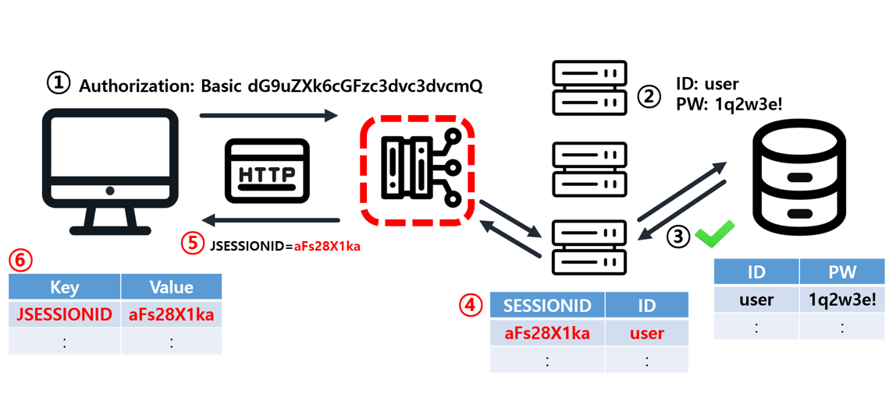

# 인증(authentication) VS 인가(authorization)

- 인증 (authentication) : 서비스에 등록된 유저의 신원을 확인하는 과정 (로그인)

- 인가(authorization) : 인증된 사용자의 권한에 대한 허가를 나타낸 것

# web 에서의 인증과 인가

- 사용자가 사이트에 회원가입과 로그인을 하는 과정 (인증)
- 로그인후 게시함에 글을 읽고 쓸 수 있는 권한이 생김 (인가)
- 다른 사람이 쓴 글을 수정, 삭제할 수 없는 것은 나에게 게시글을 수정할 권한(인가)가 없기 때문

# 인증 & 인가 방법

1. request header
2. cookie
3. session
4. JWT

1~3은 전에 한 내용이라 가볍게 읽으면 될듯!

## request header

1. 로그인시 ID, PW를 URL 앞에 넣어 요청을 보낸다.
   (https://<b>id:pw</b>@www.minsol/login)

2. 이런식으로 요청을 보내면 url에 id:pw 부분을 파싱해서 base64 를 통해 인코딩을 함

3. 인코딩한 문자열을 요청헤더의 authorization 에 넣어서 보내줌

4. 서버는 클라이언트의 요청이 DB에 있는지 확인하고 응답을 줌

### request header 의 문제점

매번인증을 해야하는 번거로움이 있다.

## cookie

쿠키 로직

1. 클라이언트가 페이지를 요청
2. 서버에서 쿠키를 생성
3. HTTP 헤더에 쿠키를 포함 시켜 응답
4. 브라우저가 종료되어도 쿠키 만료 기간이 있다면 클라이언트에서 보관하고 있음
5. 같은 요청을 할 경우 HTTP 헤더에 쿠키를 함께 보냄
6. 서버에서 쿠키를 읽어 이전 상태 정보를 확인, 정보 변경 할 필요가 있을 때 쿠키를 업데이트 하여 변경된 쿠키를 HTTP 헤더에 포함시켜 응답

### 쿠키 문제점

보안에 취약하게 노출되어있어 사용자 정보를 쉽게 탈취할 수 있다.
client가 server 보다 상대적으로 보안이 취약함

그래서 session을 사용

## session

세션 로직

1. 사용자가 로그인을 시도함.
2. 회원이 맞는지 회원 DB에서 확인합니다.(인증)
3. 사용자의 고유한 ID 값을 부여하여 세션 저장소에 저장함.
4. 그 다음 이와 연결되는 세션 ID 를 발행
5. 생성한 세션 ID를 로그인 요청에 대한 HTTP 응답 헤더에 담아 클라이언트로 전송
6. 클라이언트는 서버에서 세션 ID 를 받아 쿠키에 저장
7. 인증이 필요한 요청마다 쿠키를 HTTP 요청 헤더에 담아서 서버에 전송
8. 서버는 받은 쿠키(세션 ID)를 검증
9. 서버는 검증이 완료되면, 사용자에 맞는 데이터(유저 정보)를 내려다 줌.

### 장점

1. client가 데이터를 갖고 있지 않게 된다. 해커가 정보를 가져가게 되더라도 크게 위험하지 않음
2. 가져가더라도 session 만료기간을 설정할 수 있어 위험 방지할 수 있다.
3. session의 관리를 server에서 하고있어 탈취된 session을 server에서 삭제하면 사용하지 못하게된다.

### 단점

### 1. session DB가 없을 경우

1. 서비스가 커지게 되어 서버를 여러개 두게되면 로드 밸런서도 생기게 된다.

   - 로드밸런서란 ? : 서버에 가해지는 트래픽을 여러 대의 서버에 균등하게 분산시켜주는 역할을 함

2. 한번 인증돼서 sessionID를 받게 되면 다음 요청땐 session만 이용해서 요청을 함
3. 사용자가 첫번째 인증을 요청하고 두번째 인증이 필요해 다시 요청을 한경우
   로드 밸러서가 sessionID값이 저장되어있는 서버가 아닌 다른 서버에 요청을 보내개 되면 해당 서버는 sessionID 값이 없어 오류가 발생하게 됨

=> 위와같은 문제는 server 하나하나 session 을 관리하고 있기 때문이다. sessionDB를 이용해 위와 같은 문제를 해결할 수 있음

### 2. sessionDB의 문제

sessionDB를 만들게 되면 로드 밸런서를 사용하더라도 세션DB에서 세션 값을 확인하니 서버간 세션값이 공유 안되는 문제를 해결할 수 있음
하지만 클라이언트가 많아져 요청이 많아지게되면 session DB에 과부하가 생길 수 있다는 문제가 있음

## JWT

JWT 자체는 해독이 쉽기때문에 JWT내에는 민감한 정보를 담지 않는다.

JWT 로직

1. 요청을 보낸다.
2. 서버에서 DB로 ID와 PW를 체크한다.
3. 체크가 완료되면 secret key를 이용해서 토큰을 만들어 낸다.
4. 토큰을 헤더에 담아서 클라이언트에 보낸다.
5. 이후에는 JWT를 요청과 응답을 주고받음

### JWT장점

1. session같은 경우는 session DB를 사용했어야했는데 JWT는 각각의 서버에 secret key를 통해 토큰을 해독해 인증을 하면 된다는 장점이 있다.
2. 확장성이 좋아 서버가 많아져도 똑같이 진행할 수 있다.

### 단점

토큰이 탈취당하면 해당해커는 사용자와 같은 지위를 갖게된다.

## refresh token

refresh token은 위의 문제를 해결하고자 나온 token방식이다.

로직

1. 요청을 보낸다.
2. secret key를 통해 token을 만들어낸다. 이때 access token과 refresh token을 같이 만들어 낸다. 이때 access token은 refresh token보다 만료기간이 짧음

3. access token은 저장하지않고 refresh token만 따로 저장소에 저장한다.
4. access token과 refresh token을 한번에 응답헤더에 담아 클라이언트로 보낸다.
5. 클라이언트는 둘다 저장함
6. 다음부터는 클라이언트가 access token을 이용하여 요청을 보낸다.

<b>access token이 만료된 이후 로직</b>

1. 사용자는 똑같이 요청을 보낸다.
2. 만료된 access token이면 클라이언트에 만료되었다고 알려준다.
3. 클라이언트는 다시 access token과 refresh token을 같이 보낸다.
4. server 에 저장되어있는 refresh token과 비교한다.
5. 확인이 되면 secret key를 이용해 access key를 다시 발급해준다.
6. 사용자는 갱신된 access key를 사용함
7. 만약 refresh key가 만료되었다면 secret key를 이용해 access token과 refresh token을 다시 발급해준다.

- [[테코톡] 토니의 인증과 인가](https://youtu.be/y0xMXlOAfss?si=Zd4l9cndH7A677tE)
