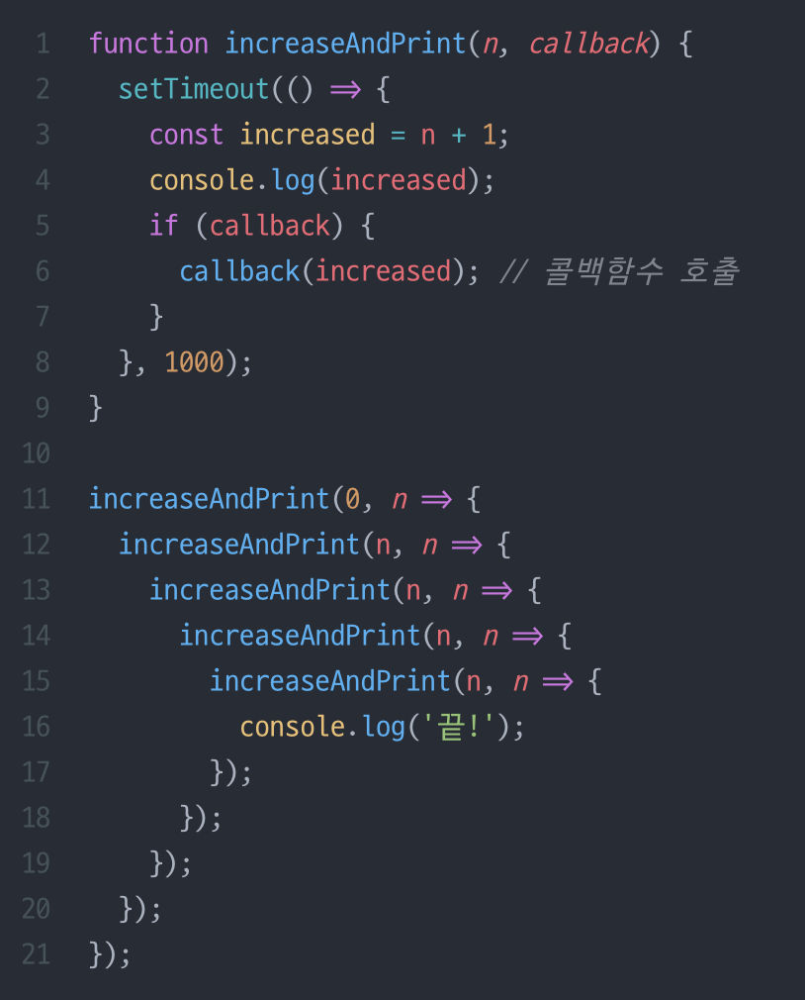
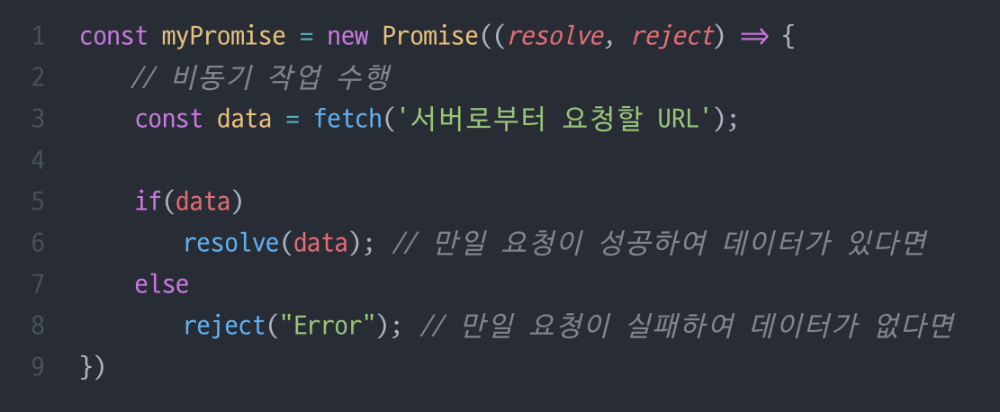
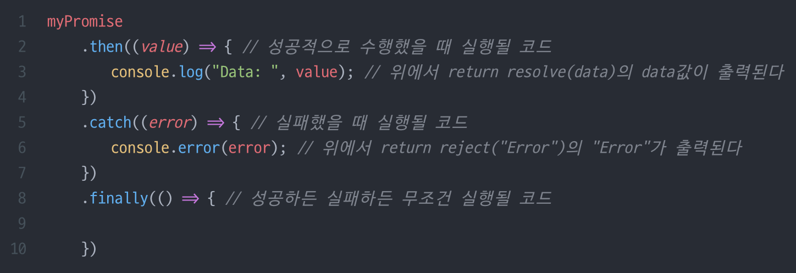
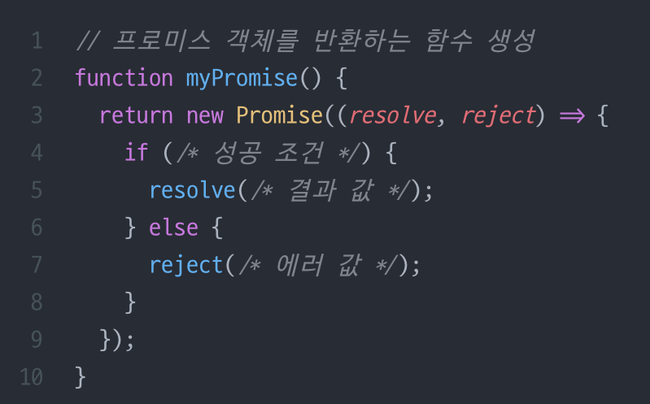
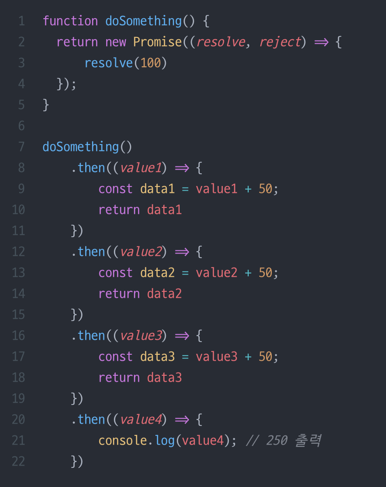
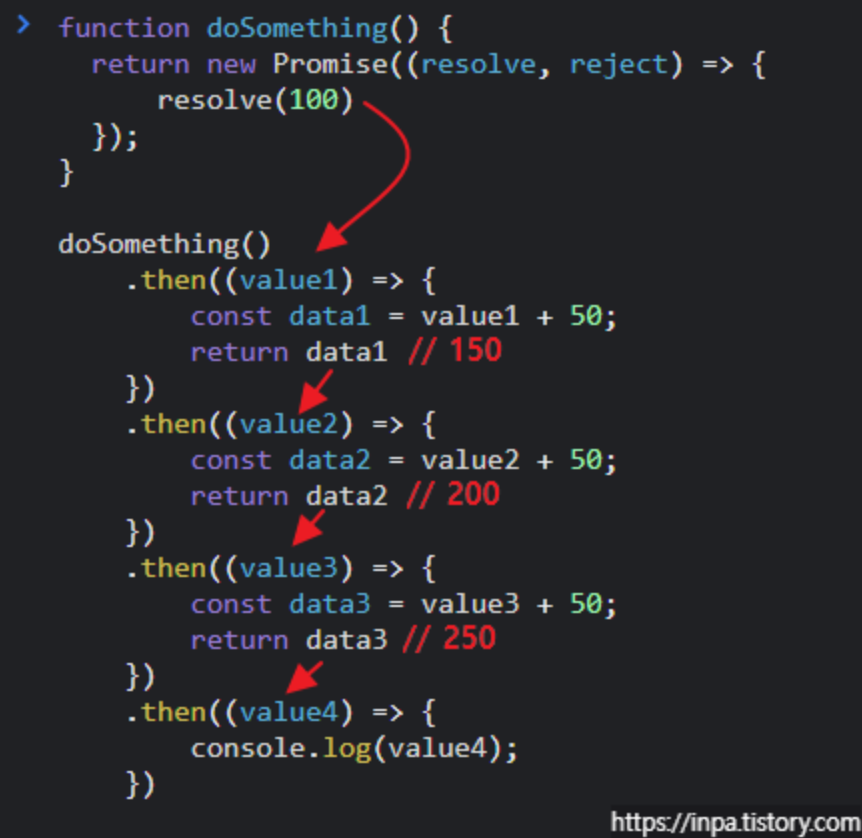
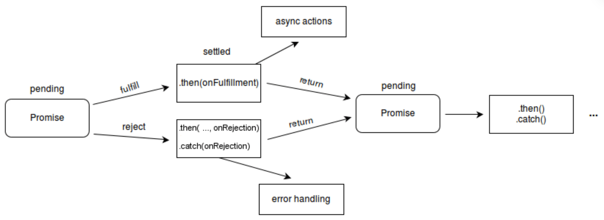

# promise 

## 비동기처리란?
특정 코드의 실행이 완료될 때까지 기다리지 않고 다음코드를 먼저 수행하는 것.

기존에는 콜백함수로 비동기 처리를 했지만 콜백함수의 단점때문에 promise 사용

<b>콜백함수란 ?</b> 비동기 작업이 완료되면 호출되는 함수의 비동기 함수의 매개변수로 함수 객체를 넘기는 기법 
함수 내부에서 함수호출을 통해 비동기 작업의 결과를 받아 인자로 주면 이를통해 후속 처리 작업을 수행할 수 있다. 

<b> 콜백함수의 단점 </b> 
코드가 복잡해지고 가독성 떨어짐. 특히 여러개의 비동기 작업을 순차적으로 수행해야 할 때는 콜백 함수가 중첩되어 코드의 깊이가 깊어지는 현상, 콜백지옥이 있음 

콜백함수의 예 

프로미스를 사용하면 비동기 작업의 개수가 많아져도 코드의 깊이가 깊어지지 않는다.

## 프로미스 
프로미스 객체는 비동기 작업의 최종 완료 또는 실패를 나타내는 객체. 

## 사용법 
<b>객체 생성</b> 

promise 객체의 첫번째 인수는 작업이 성공했을 때 성공을 알려주는 객체 
두번째는 작업이 실패했을 때 실패를 알려주는 객체 

<b>객체 처리</b>
위에서 만들어진 객체는 비동기 작업이 완료된 이후에 다음작업을 연결시켜 진행할 수 있다. 
만일 성공하면 resolve(data)를 호출하게 되면, 바로 .then()으로 이어져 then메서드의 콜백함수에서 비동기 성공에 대한 추가 처리를 진행한다. resolve함수의 매개변수의 값이 then메서드의 콜백함수 인자로 들어가게됨
반대로 실패하면 reject()를 호출하게 되고 바로 .catch()로 이어져 catch메서드의 콜백함수에서 실패에 대한 추가 처리를 함 

### 함수 등록 
위와같이 객체를 변수에 바로 할당하는 방식을 사용할 수도 있지만 재사용성, 가독성, 확장성 등의 이유로 보통은 다음과 같이 함수로 감싸서 사용함 

  

## 프로미스 상태 
1. pending(대기) : 처리가 완료되지 않은 상태 
2. fulfilled(이행) : 성공적으로 처리가 완료된 상태 
3. rejected(거부) : 처리가 실패로 끝난 상태 

### 1. pending 상태
아직 비동기 처리 로직이 완료되지 않은 상태이다. 

### 2. fulfilled 상태 
비동기 처리가 완료되어 resolve가 수행되면 fulfilled 상태가 된다. 그리고 then 메서드를 호출

### 3. rejected 상태 
비동기 처리가 실패해서 reject를 호출하면 rejected 상태가 된다. 
이후 catch 호출

## 프로미스 핸들러
.then, .catch , .finally 프로미스 상태에 때라 실행되는 콜백함수 

1. .then : 프로미스가 fulfilled 상태가 되었을때 실행할 콜백함수를 등록하고, 새로운 프로미스를 반환

2. .catch : 프로미스가 rejected 상태가 되었을 때 실행할 콜백함수를 등록하고, 새로운 프로미스를 반환 

3. .finally : 프로미스의 성공과 실패에 상관없이 콜백함수를 등록하고 , 새로운 프로미스를 반환 

## 프로미스 체이닝
프로미스 핸들러를 연달아 연결하는 것, 여러개의 비동기 작업을 순차적으로 수행할 수 있다. 

dosomething으로 프로미스를 생성하고 then을 통해 이행 핸들러를 연결하는 과정 

### 프로미스 상태 흐름도

## 프로미스 정적 메소드 
프로미스 객체는 여러가지 정적 메소드를 제공한다. 정적 메서드는 객체를 초기화 & 생성하지 않고도 바로 사용할 수 있기 때문에 비동기 처리를 보다 효율적으로 구현할 수 있다. 

### 1. Promise.resolve()

