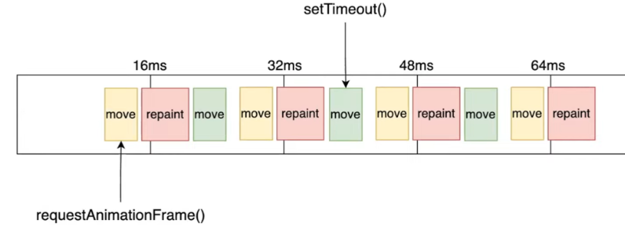
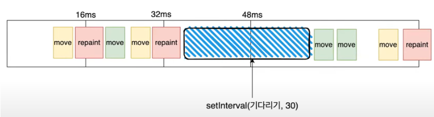
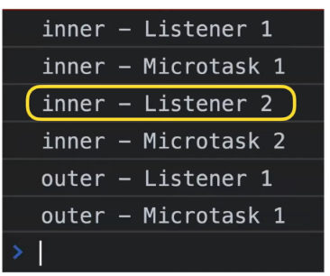
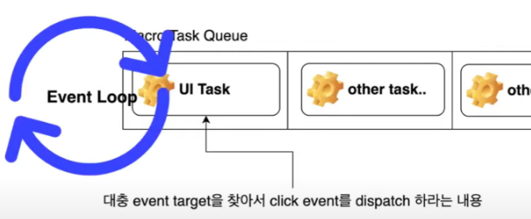

# 브라우저의 Event Loop

- 브라우저는 어떤 방식으로 동시성을 지원하는지 알아보자!

<br><br>

## 브라우저가 하는 일

- HTML 코드를 읽어서 화면에 그림을 그려준다
    - HTML 태그를 바탕으로 돔을 생성하다 중간에 script태그를 만나면 js코드를 실행

- HTML 코드를 다 읽어도 브라우저는 계속 일한다
    - 사용자의 제스처 입력을 기다리거나
    - 주사율 60hz 기준 매 16.7ms마다 돔을 다시 그리는 걸 목표로 한다
    - 이 때문에 스크롤을 내리면 그에 맞게 뷰가 변하는 것!

- 이외에도 다양한 일을 함
    - 브라우저의 프로세스 위에서 실행
    - Network Process, Browser Process, UI Process, Storage Process, Renderer Process 등

<br><br>

## Main Thread

- Randerer 프로세스 내부의 메인 스레드!
- 하는 일
    - 랜더링
    - Javascript 코드 실행

- 일은 순서대로 일어나기 때문에 한 군데서 느려지면 다른 곳에서는 기다려야함


<br><br>

## 타이머를 돌리고, 네트워크 통신을 수행해도 화면이 얼지 않는 이유

- 메인 스레드에서 랜더링과 js코드 실행까지 하는데 화면이 얼지 않음
- 이유는 event loop 때문!

```javascript
while (true) {
    task = queue.pop();
    execute(task);

    if (isRepainTime()) {
        repaint();
    }
}
```
- 크롬에 탭 하나 추가 시 실행하는 일


### task
- 콜백함수를 실행하는 일(execute callback)
    - 콜백함수/ 핸들러라고 생각해도 괜찮음

- Main 스레드의 파서가 script태그를 만나 실행하는 것도 task
    - 작성한 js코드가 하나의 task로서 처리된다

- event 객체를 특정 event target에 dispatching 하는 일도 task
    - dispatch: 아래 3가지 일을 거치면서 addeventlistner로 걸어놓은 핸들러들이 호출됨
    1. capture phase 
    2. target phase 
    3. bubbling phase

- 그 외에도 parsing, reacting to DOM manipulation 등 다양한 일을 함


### Queue

- web API를 사용하여 타이머나 네트워크 통신을 한 뒤에 <u>**콜백함수는 Task Queue에 들어간다**</u>
    - 타이머나 네트워크 통신은 메인스레드가 아닌 다른 프로세스/스레드에서 실행된다
    - 일이 끝난 후 task queue에 콜백함수를 넣어줌

- setTimeout()이나 fetch()가 끝나고 큐 인에 쌓인 task들
    - 이벤트 루프 안에서 하나씩 빼짐 -> js 엔진 위에서 실행됨

<br/><br>

# 3가지 Queue

### MacroTaskQueue
- setTimeout, SetInterval, Event Dispatch, networking response ...
- 이벤트 루프는 MacroTaskQueue에 있는 task를 하나만 빼서 실행 후 다음 루프로 넘어감

### MicroTaskQueue
- Promise, MutationObserver
- 이벤트 루프는 MicroTaskQueue가 빌 때까지 task를 처리
    - task 처리 중 queue에 또 task가 들어가도, 다음 루프로 미루지 않고 끝까지 처리
- js Engine의 call stack이 비자마자 <u>**가장 먼저 처리**</u>(우선순위 가장 높음)
- 무한루프 조심


### AnimationFrameQueue
- requestAnimationFrame으로 등록한 callback 함수들이 queue에 들어감
- repaint 직전에 queue에 있는 task들을 전부 처리함
- animation에 사용하면 frame drop을 최소화 가능


<br/><br/>

# MacroTaskQueue

### 1. task를 쪼개지 않고 js엔진에서 끝까지 카운팅하는 경우
- main 스레드는 js엔진에 붙잡혀있음
    - repaint가 되지 않아 화면이 얼어있다

- 화면이 얼어있어도 나중에 macroTaskQueue에 들어온 클릭이벤트가 수행된다
    - 로그가 찍힘

### 2. MacroTaskQueue로 일을 쪼개는 경우
```javascript
let i = 0;
let start = Date.now();
function count() {
    do {
        i++;
    } while (i % 10 ** 3 != 0);

    if (i === 10 ** 6) {
        const end = Date.now();
        alert("카운팅 완료!");
    } else {
        setTimeout(count); //재귀호출, macroQueue에 넣음
    }
}
```
- 클릭 시 바로 반응됨
    - 이벤트 루프가 queue에 있는 카운팅 task 처리 후 화면갱신 작업을 반복함

- 처리 속도는 느리지만, 화면이 절대 얼지 않음

### 3. 1000씩 일을 쪼개 microTaskQueue에서 처리


- 큐가 빌 때까지 일을 처리하고, 처리되는 와중에 큐에 들어와도 다음 루프로 밀리지 않음
    - 화면을 갱신할 여유가 없다 
    - 바로 반응 x


<br/><br/>

# MicroTaskQueue
```javascript
const observer = new MutationObserver((mutation) => {
    mutation[0].target.removeAttribute('hidden');
});

observer.observe(whiteBox, {
    attributes: true
});

removeWhiteBoxBtn.addEventListener('click', () => {
    whiteBox.setAttribute('hidden', true);
    updateCount();
});
```
- mutationObserver는 whiteBox 속성에 변동사항이 생기면 queue에 넣음
- 하지만 아무리 클릭해도 랜더링이 일어나기 전에 히든 속성을 삭제하는 콜백 함수가 실행됨
    - 랜더링 시 hidden 속성은 제거된 상태

- mutationObserver의 콜백함수가 microTaskQueue가 아닌 macro에 들어가면
    - hidden 속성을 삭제하는 콜백 함수가 랜더링 후 호출될 수 있음
    - 10번 중 한 두번은 깜빡함

- 즉, micro는 지체되지 않고 바로바로 처리되어야하는 일들이 들어가기 적합하다!


<br/><br/>

# AnimationFrameQueue
```javascript
function move(el) {
    el.style.left =  (el.offsetLeft + 5) + 'px';
    if (el.offsetLeft > 1000) {
        return false;
    }

    return true;
}

function moveWithSetTimeout(el) {
    for (left i =0; i<1000/5; i++) {
        setTimeout(() => {
            move(el);
        }, i* 1000 / 60);
    }
}

function moveWithRequestAnimationFrame(el) {
    if (move(el)) {
        requestAnimationFrame(() => {
            moveWithRequestAnimationFrame(el);
        });
    }
}
```

- 그냥 실행 시 moveWithSetTimeout와 moveWithAnimation..은 비슷한 속도로 움직임
- 하지만 macroTaskQueue에 30ms걸리는 일을 30ms마다 추가하면 moveSetTimeout이 더 빨리감




- 중간 방해 x
- 각자 호출한 move함수가 번갈아가면서 잘 호출됨



- 기다리는 시간이 추가되면 macro에 move함수가 2개 쌓임
- 2~3 프레임 중 한 번은 move함수가 2번 호출, 더 빨리감


<br>

```javascript
$inner.addEventListner('click', (e) => {
    Promise.resolve().then(() => console.log('inner - MicroTask 1'));
    console.log('inner - Listner 1');
});

$inner.addEventListner('click', (e) => {
    Promise.resolve().then(() => console.log('inner - MicroTask 2'));
    console.log('inner - Listner 2');
});

$outer.addEventListner('click', (e) => {
    Promise.resolve().then(() => console.log('inner - MicroTask 3'));
    console.log('inner - Listner 3');
});
```

<br>



- 결과 중간에 Microtask1이 껴있음
- inner 클릭 시 브라우저는 클릭이벤트를 task로 만들어서 macro에 넣어준다

<br>




- 이벤트 루프가 macro에서 task를 빼서 처리하면 이벤트 target에 이벤트가 dispatch된다

    - 이벤트 타겟에 우리가 걸어둔 이벤트 핸들러들이 하나하나 호출됨


<br>

- 맨 처음 등록한 핸들러가 js엔진의 call stack에 쌓이고 실행된다
- promise가 resolve후 바로 then 호출했으니 콜백함수가 micro에 들어가면서 바로 콘솔로그가 실행됨
- 다음 핸들러인 Listener2는 동기적으로 바로 호출되지 않음
    - Listner1이 호출되면 callback에 아무것도 없게 됨
    - callback이 비었으니 이벤트 루프는 macro task를 처리한다
- 그래서 이런 결과 나옴


+) 마우스로 클릭하지 않고 코드상에서 lick을 dispatch하면 클릭 이벤트 핸들러들이 동기적으로 실행된다
- listner들 다 호출된 후, call stack이 비면 micro 큐들이 처리됨


click event handler는 동기적으로 호출되지 않는다!
