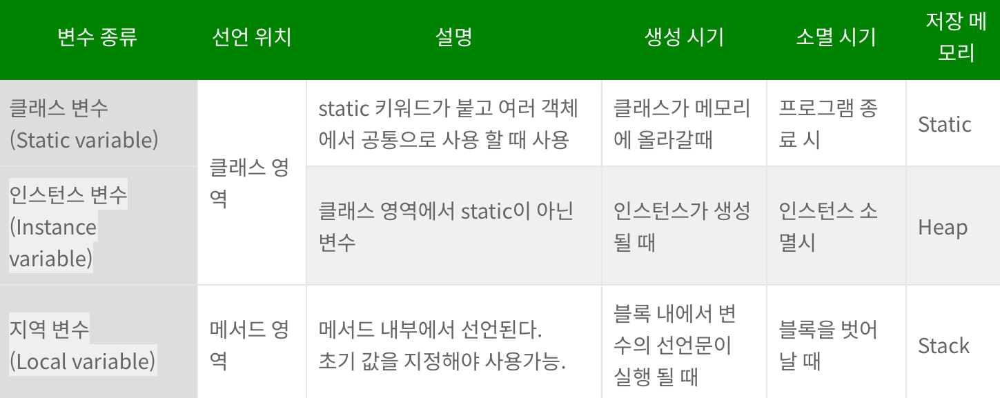

# JVM Stack& Heap

## 1. JVM

c나 c++는 컴파일 플랫폼과 타겟 플랫폼이 다를 경우 프로그램이 동작하지 않음
c++/c는 크로스 컴파일을 통해 기존문제를 해결했다.

- 크로스 컴파일? : 타겟 플랫폼에 맞춰 컴파일하는 것

<b> => 자바는 JVM으로 문제 해결함 </b>
JVM이란?
java virtual machine의 약자이며 자바 가상머신이라고 불린다.
java의 바이트 코드를 해석하고 실행하는 역할을 한다.
java는 jvm을 통해 os에 상관없이 실행을 할 수 있다.

### JVM실행 순서

1. java 파일을 컴파일러를 통해 .calss파일로 변환한다.
2. .class 파일을 JVM의 classLoader에게 보낸다.
3. 클래스 로더에서 JVM런타임 영역으로 로딩하여 메모리에 올린다.

## 2. JVM 내부구조

## runtime data area

method area : 클래스 로더가 클래스 파일을 읽어오면 클래스 정보를 파싱해서 method area에 저장

heap : 프로그램을 실행하면서 생성한 모든 객체를 저장

<b>-> 여기까지 모든 스레드가 공유 </b>

program counter : 각스레드는 메서드를 실행하고 있고 pc는 그 메서드 안에서 몇 번째 줄을 실행해야 하는지 나타내는 역할

satck : 스레드별로 1개만 존재하고 스택 프레임은 메서드가 호출될 때마다 생성된다. 메서드 실행이 끝나면 스택 프레임은 pop되어 스택에서 제거됨

- stack frame : 메서드가 호출될 때마다 새로 생겨 스택에 push 된다.

native method stack : 다른 언어로 작성된 메서드를 의미한다.

## 3. JAVA의 메모리 영역

자바 프로그램을 실행하게 되면 JVM은 OS로 부터 메모리를 할당 받는다. 할당받은 메모리는 자바 프로그램에 맞게 여러개의 영역으로 나누어 사용하게 된다.

각 영역은 목적에 맞게 사용되고, 어플리케이션의 성능에 영향을 미친다. 같은 기능을 하는 어플리케이션 일지라도, 메모리 관리에 따라 성능에 차이가 생긴다는 이야기다. 메모리를 관리하지 않고 구성하게 된다면 StackOverFlow 가 발생하여 어플리케이션이 종료될수도 있다는 말이다, 혹은 어플리케이션의 속도가 크게 저하 될수도 있다.

- JVM의 메모리는 크게 3가지로 이루어져 있다.

1. Heap 영역
2. Stack 영역
3. Static(Method) 영역

### JAVA 의 변수 종류

자바는 4가지 종류의 변수가 존재한다.

### static 영역

Static 영역 혹은 Method 영역이라고 불린다. 클래스 변수나, static 으로 선언된 것들이 해당 메모리 영역에 저장된다.

- JVM이 실행될 때 Class 가 로딩될 때 생성.
- Class의 정보, Static 변수(클래스 변수), 생성자(Constructor), 메소드(Method)와 같은 것들을 저장한다.
- Static 영역에 있는 것은 어디서든 접근 가능 하다.
  JVM이 종료 시(프로그램이 종료 시) 메모리에서 해제 된다. 즉 프로그램이 종료되기 전까진 메모리 상에 존재하게된다.
- 그렇기 때문에 어디서든 접근이 가능한 것이며, 무분별 하게 사용될 경우 메모리 부족 현상이 발생할 수 있다.

### heap 영역

객체를 생성할 때 사용되는 메모리 영역이다.

- new 를 사용해 객체를 생성할 때 저장된다.
- 참조형 데이터 타입이 저장된다. (String, 배열(array), enum, class, interface), Object
- Heap 영역의 데이터들을 가르키는 Reference(참조 주소)는 Stack영역에 적재된다. Reference를 통해서만 Heap 영역의 데이터들에 접근, 핸들링 할 수 있다.
- 호출이 종료되도 삭제되지 않는다. -> GC(가비지 컬렉터)에 의해 메모리에서 해제된다.
- 쓰레드가 몇개가 존재하든, 단 하나의 영역만 존재한다.
  (Stack 영역의 경우 쓰레드 별로 1개씩 생성된다.)

### stack 영역

- 기본 자료형(원시 자료형, Primitive type), 지역변수, 매개변수가 저장되는 메모리.(int, double, boolean, byte)
- Heap 영역에 생성된 데이터의 참조값이 할당됨.
- 메소드가 호출될 때 메모리에 할당, 메서드 종료시 메모리에서 삭제됨.
- 자료구조 Stack의 구조이다, LIFO(Last In First Out)
- 각 Thread 마다 자신만의 Stack 을 가진다. (1:1) - (Thread : Stack)
  Thread는 내부적으로 Static, Heap, Stack 영역을 가진다.
  Thread는 다른 Thread에 접근 할 수 없지만, static, Heap 영역을 공유하여 사용 가능.
