# Spring vs Servlet

## Servlet이란?

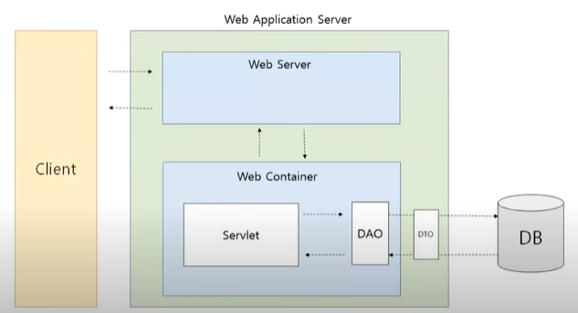
<br>
처음 웹 서버는 클라이언트 요청에 대해서 정적인 페이지로만 응답할 수 있었다.

그래서 웹 서버에 프로그램을 붙여 동적인 페이지를 생성하기 시작했다

**Servlet** 또한 동적인 페이지를 만들기 위해 웹서버에 붙이는 프로그램의 일종이다.


## Servlet의 역할?
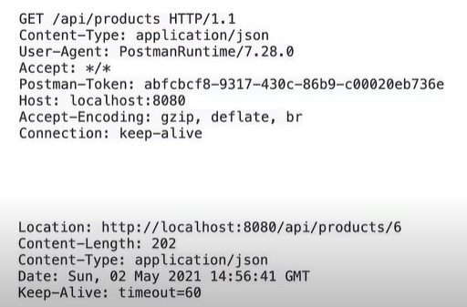

위는 HTTP 요청 및 응답 코드이다.

개발자들이 이 요청 텍스트를 매번 분석하고 위와 같은 형식의 응답을 만들어내려면 어려움


Servlet을 활용해 Servlet이 요구하는 구현 규칙을 지켜주면서 Servlet을 정의해준다면
 HTTP 요청정보를 쉽게 사용할 수 있고, 처리 결과를 쉽게 응답으로 변환 가능!

 => **개발자들은 처리 로직에 더 집중할 수 있다.**

 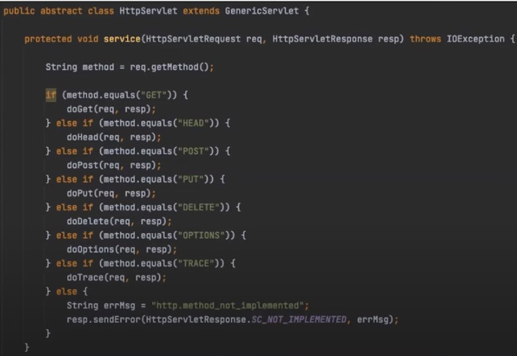
 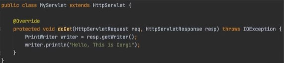
 <br>
 이와 같이 요청에 따른 처리 로직, 즉 서비스 메서드만 재정의하여 구성하면 된다!


## Servlet Container와 Servlet이 호출되는 과정

### Servlet Container란?
 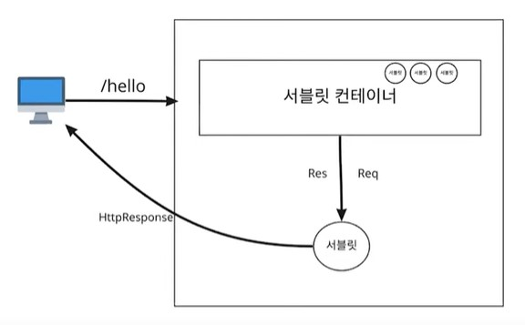
 <br>
서블릿을 담고 관리하는 큰 틀이라 생각하면 된다. Servlet을 생성하고 필요한 순간에 호출하고 적절한 시점에 소멸시키는 즉, Servlet의 LifeCycle(생명주기)를 관리한다.

<br>
<br>

 1) <span style='background-color: #fff5b1'>**사용자의 요청이 들어옴**</span>
=> 해당 요청과 매핑된 Servlet을 찾음

 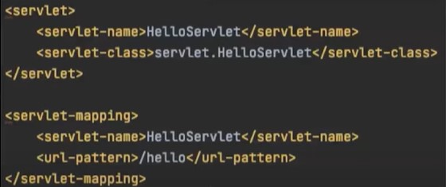
 <br>
(/hello라는 요청이 들어오면 HelloServlet이란 Servlet으로 처리하겠다.)

이때, 매핑될 Servlet은 위와 같은 설정 파일에서 읽어온다


2) <span style='background-color: #fff5b1'>**컨테이너는 해당 Servlet 인스턴스가 컨테이너에 존재하는지 파악**</span>
있으면 -> 그대로 사용
없으면 -> 생성해서 사용

<br>

3) <span style='background-color: #fff5b1'>**스레드를 생성하고 respone, request를 인자로 서비스를 호출한다.**</span>

<br>

4) <span style='background-color: #fff5b1'>**response, request 인자를 소멸하고 끝이난다.**</span>
이때, Servlet 인스턴스는 싱글톤으로 관리되기에 소멸시키지는 않는다
소멸되지않고 있다가 다음에 동일한 요청이 들어오면 재사용한다.

<br>


### 만약 여러 요청이 동시에 들어오면?
=> **멀티스레드로 처리한다**

 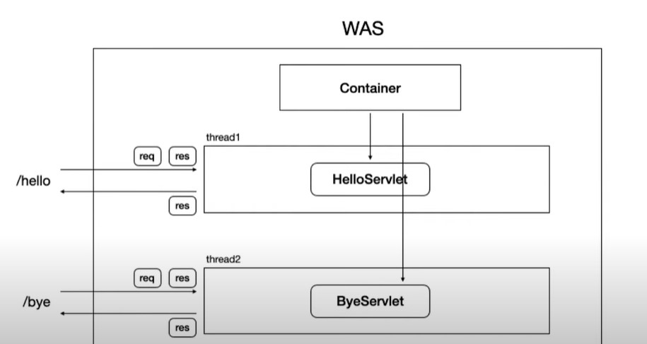

 스레드당 다른 서블릿이 처리 or 여러 스레드에서 한 서블릿의 여러 요청 처리

<span style='background-color: #ffdce0'>**주의사항**</span>
- 스레드 생성 자체는 고비용 작업
- 다른 스레드로 전환하는 ContextSwitch가 많은 오버헤드 발생시킴
- 스레드 수에 대한 제한이 없다면 많은 요청을 처리하기 위해 많은 스레드를 생성하다가 서버의 하드웨어의 한계를 넘어버리면 서버가 터질 위험


-> 요청 당 서블릿을 정해주는 것에는 많은 어려움이 있음.

관리 측면
- 멀티스레딩 다뤄야 함

개발 측면
- Handler의 공통 로직이 중복된다는 문제

#### 공통 로직?
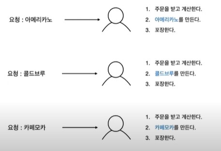
<br>

- 위 그림에서 주문,계산,포장이 공통 로직에 해당
<br>
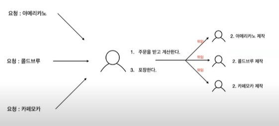
<br>

- 이처럼 손님의 요청을 앞단에서 처리할 수 있는 매니저를 둔다면 더 효율적으로 구성 가능.
<br>
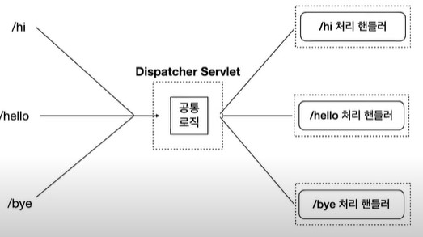
<br>

- 이처럼 모든 요청을 받는 전면 컨트롤러 Servlet인 **Dispatcher Servlet을 두는 패턴을 프론트 컨트롤러 패턴**이라 한다.

- 서블릿은 하나만 두고 모든 요청을 다 받을 수 있게 해준다.


## Dispatcher Servlet이 web 요청을 처리하는 과정


<br>
하지만 앞선 그림과 같이 구성했을 경우
많은 요청이 몰린다면 매니저 또한 일을 제대로 처리하지 못할 수 있다.

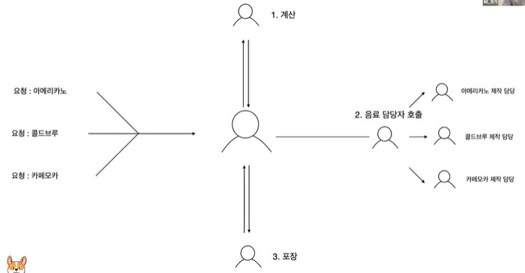
<br>
위와 같이 전면 매니저가 모든 요청을 처리는 하되, 계산 담당, 음료 담당, 포장 담당과 같이 역할을 더 세분화하면 더 효과적으로 구성할 수 있을 것이다.

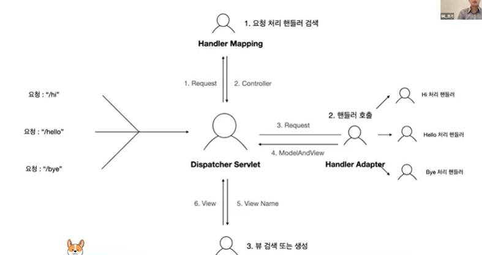

1) Dispatcher Servlet은 모든 요청을 받고 Hanlder Mapping 인스턴스가 요청을 처리
2) 컨트롤러를 찾아서 반환하고 Hanlder Adapter는 그 컨트롤러의 메서드를 호출하여서 처리 로직을 수행
3) 그 처리 결과를 ModelandView 객체로 변환해서 Dispatcher Servlet으로 전달
4) 뷰 리졸버를 이용해 뷰를 찾거나 생성
5) 해당 뷰에 데이터를 추가 => 응답결과 생성
6) JSP나 Timeleaf와 같은 파일로 응답

<span style='background-color: #f5f0ff'>
역할을 분리하며 일이 많아져 보이지만, 나머지는 Spring이 Spring Container로 부터 주입받기에 개발자가 해야할 일은 Controller 또는 Handler 구현이 끝이다!
</span>

<br>

### Dispatcher Servlet 구성요소

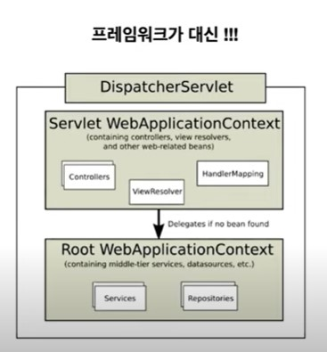


- **Servlet WebApplicationContext**
 : 웹 요청처리 관련 객체들 관리
- **Root WebApplicationContext**
 : 이 외에 서비스, 레포지토리 관련 객체 관리

 이를 통해 서블릿 설정파일만 잘 작성해준다면 Dispatcher Servlet이 일을 처리할 때, 설정대로 생성된 객체가 스프링 컨테이너 내에서 관리되고, 필요한 부분에는 알아서 주입된다. 


 결국 스프링으로 웹 요청을 처리한다는 것은
 스프링 mvc에서 제공하는 디스패처서블릿과 웹 요청 처리 관련 구현체들을 사용할 수 있다는 것에 더불어, 스프링 컨테이너 즉 [스프링 IoC](#spring의-di의존성-주입ioc제어의-역전)를 사용해서 개발할 수 있다는 이야기이다. 

 => 이를 통해 개발자들이 Handler, 즉 요청 처리 로직에만 신경 쓸 수 있게 해준다.


# Appendix
## Spring의 DI(의존성 주입)/IoC(제어의 역전) ?


```java

class A {
    public void methodOfA() {
    //    B b = new B();
    //    b.example();
          C c = new C();
          c.example();
    }
}

class B {
    public void example(){
        ...
    }
}
class C {
    public void example(){
        ...
    }
}
```

만약 B 객체를 사용하던 A가 C를 새롭게 정의하여서 사용하고자 한다면 다음과 같이 하나하나 바꿔줘야한다.
=> 실무에서 A가 여러개라면 하나하나 수동적으로 바꿔줘야한다

**Spring**은 이러한 문제점을 최소한의 수정으로 변화를 유연하게 수용할 수 있도록 해준다.


```java
// (1) A가 사용하는 메서드를 인터페이스로 정의(추상화)
interface I {
    void example();
}

class A {

    // (3) 인터페이스 타입의 필드 선언
    private I i;
    // (4) 생성자를 통해 외부로부터 인스턴스를 받아와 i를 초기화(다형성)
    public A(I i) {
        this.i = i;
    }

    public void methodOfA() {
        i.example();
    }
}

// (2) A가 사용하는 메서드를 가진 객체들이 I를 구현하도록 함
class B implements I {
    public void example(){
        ...
    }
}
class C implements I {
    public void example(){
        ...
    }
}
```

위 예제에서 **A는 자신이 사용할 객체를 스스로 생성하지 않고, 생성자를 통해 외부로부터 받아오고 있다.** 이때, A가 사용할 객체를 결정하고 생성해서 A가  인자로 전달해주어야한다.

=> 이 역할을 Spring이 해주는 것이다. 로직 외부에서 설정에 따라 사용할 객체를 지정해줄 수 있다.

이처럼 개발자가 아닌 Spring이 A가 사용할 객체를 생성하여 의존 관계를 맺어주는 것을 **IoC(Inversion of Control, 제어의 역전)** 라고 하며, 그 과정에서 C를 A의 생성자를 통해 주입해주는 것을 **DI(Dependency Injection, 의존성 주입)** 라고 합니다.


## 참고
[스프링과 스프링부트(Spring Boot)ㅣ정의, 특징, 사용 이유, 생성 방법](https://www.codestates.com/blog/content/%EC%8A%A4%ED%94%84%EB%A7%81-%EC%8A%A4%ED%94%84%EB%A7%81%EB%B6%80%ED%8A%B8)
<br>
[[10분 테코톡] 🐶 코기의 Servlet vs Spring](https://www.youtube.com/watch?v=calGCwG_B4Y)
