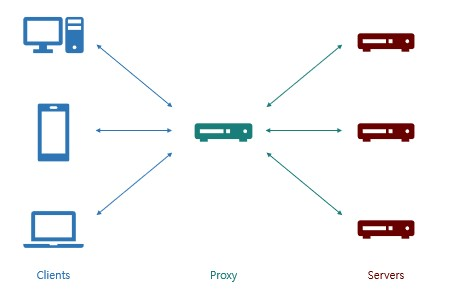
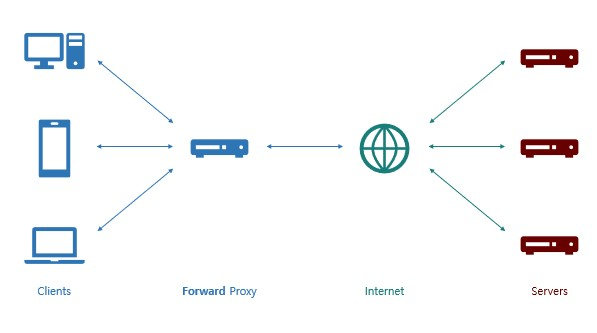

# Proxy

## Proxy Server란?

 
프록시 서버는 클라이언트가 자신을 통해서 다른 네트워크 서비스에 간접적으로 접속할 수 있게 해주는 컴퓨터 시스템이나 응용프로그램을 말합니다

## Proxy Server의 주요 특징
- pc와 외부 인터넷 사이의 징검다리 역할
- 중계를 해주기 때문에 외부 인터넷에서는 Client의 정보를 알 수 없다.
- 외부 인터넷의 내부 침입을 막는 방화벽과 관련이 있다.
- **Proxy Server는 캐시,보안,트래픽 분산 등 여러 장점이 있다.**
- IP를 바꾸기 위한 용도로 많이 사용되고 있다.
- A Client가 B Proxy에 접근하여 C인터넷(google.com)에 접속하는 방식

## Forward Proxy

 

- Proxy Server를 **클라이언트 호스트들과 접근 하고자 하는 원격 리소스 사이에 위치** 시킨다. 
- 사용자가 특정 서버에 연결하려고 하면, **사용자가 직접 pc에 연결하는 것이 아니라, Forward Proxy 서버가 요청을 받아 해당 서버에 연결**하여 그 결과를 사용자에게 전달해준다. 

### Forward Proxy 특징

#### 캐싱

 
위 예시와 같이 Proxy Server는 <b>클라이언트의 요청 사항과 응답을 저장해두고
동일한 요청이 들어올 시 Server단까지 가지 않고 응답을 넘겨준다.</b>

##### 장점
- 전송 시간 절약
- 불필요한 외부 전송 x
- 외부 요청 감소 => 네트워크 병목 현상 방지

#### 익명성

 
'클라이언트가 보낸 요청을 감춘다'라는 의미
클라이언트가 요청했지만 마치 <b>Forward Proxy가 요청한 것 처럼 Server에 Forward Proxy의 정보를 넘겨준다</b>

##### 장점
- Server가 응답 받은 요청을 누가 보냈는지 알지 못하게 함 
- Server가 받은 요청 IP = Proxy IP

## Reverse Proxy

 

- Proxy Server를 인터넷 리소스 또는 인트라넷 리소스 앞에 위치 시킴
- 사용자가 서버에 데이터를 요청하면, Reverse Proxy가 이 요청을 받아 내부 서버에서 데이터를 받은 후에 이 데이터를 사용자에게 전달
- 사용 이유는 **보안**을 위함.
- 보통 기업의 네트워크 환경은 [DMZ](https://hyeri0903.tistory.com/225)라는 메일 서버, 웹 서버, FTP 서버 등을 위한 내부 네트워크와 외부 네트워크 사이에 위치하는 구간이 존재
-**WAS를 DMZ에 두고 서비스해도 되지만, 최전방의 WAS가 해킹당하면 DB서버까지 해킹될 위험이 있음 => Reverse Proxy를 통해 서비스**

### Reverse Proxy 특징

#### 캐싱
- 클라이언트가 요청한 내용을 캐싱
- Forward Proxy와 동일

#### 보안

 

- 서버 정보를 클라이언트로부터 숨김

##### 장점
- Client는 Reverse Proxy를 실제 서버라고 생각하여 요청하기에 **실제 서버의 IP가 노출되지 않음**
- Load Balancing 수행

## Load Balancer
- 해야할 작업을 나누어 서버의 부하를 분산시켜줌(부하분산)

 

### 등장 배경

 

- 사용자 수가 증가하는 경우 단순히 Server 하드웨어 성능을 높이는 **Scale Up**을 통해 해결 가능
- 하지만 하드웨어 성능을 단순히 향상시키는 것에는 비용등과 같은 문제로 제한적이다

 

 

- 이와 같은 문제를 해결하기 위해 서버를 여러대 두는 것을 **Scale Out**이라 한다.
- 이를 위해 각 서버의 업무를 분담해주는 **Load Balancer**가 등장

### Load Balancer의 종류

 

기본적으로 OSI 7 Layer 기준으로 나뉜다

#### L2
- Mac 주소를 바탕으로 함

#### L3
- IP 주소를 바탕으로 함

#### L4
- IP & Port를 바탕으로 함

#### L7
- User Request를 바탕으로 함
- ex) 특정 URL로 접근 시 뒤에 붙이는 것(/category, /search) 혹은 QueryParam과 같이 어플리케이션 요청하는 방법에 따라 어떤 서버가 처리할지 결정해준다.