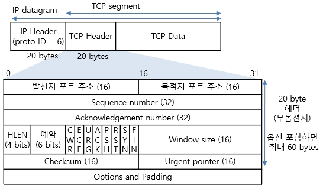
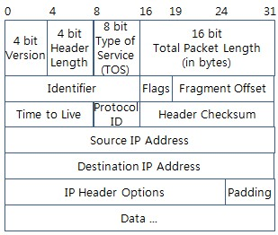
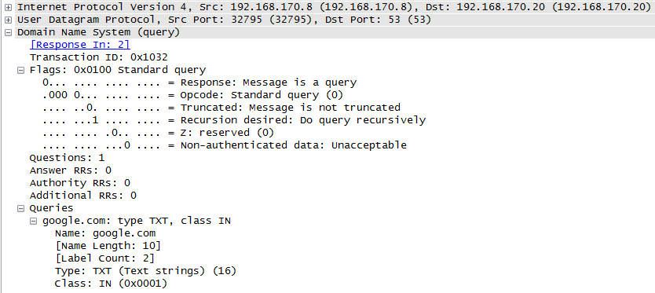
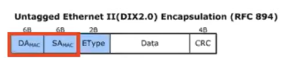
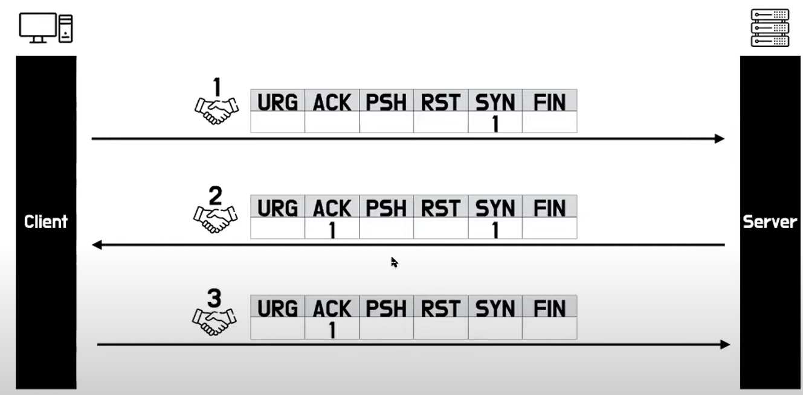
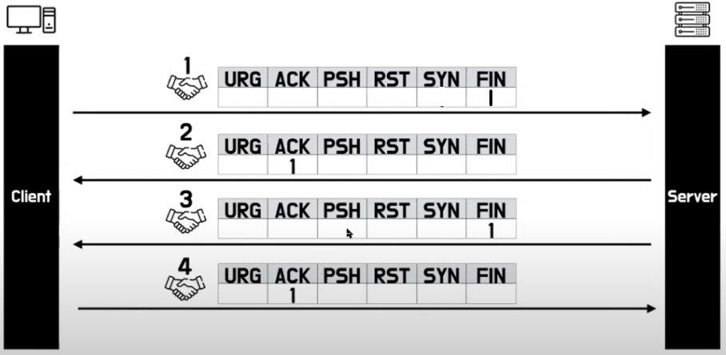

# TCP/IP

 

# 인터넷이란

- 전 세계에 걸쳐 파일 전송 등의 데이터 통신 서비스를 받을 수 있는 컴퓨터 네트워크의 시스템
- 인터넷에 통신 비용을 지불함으로써 사용가능
    - 사업자가 만들어둔 네트워크 인프라를 사용하는 것
- 해외와는 해저 광속케이블을 통해 연결됨
    - 거대한 인프라를 통해 데이터를 디지털 신호로 바꾸어 전달하고 받은 디지털 신호를 다시 데이터로 바꾸면서 네트워크 통신이 이루어짐
- 네트워크 통신을 위해 미리 정해놓은 공통 메뉴얼 = 프로토콜

 

# TCP/IP

- 인터넷에서 컴퓨터들이 서로 정보를 주고 받는데 쓰이는 프로토콜의 집합

 

# TCP/IP의 계층

1. Application Layer
    - 특정 서비스를 제공하기 위해 애플리케이션끼리 정보를 주고받음
    - 브라우저와 웹서버가 HTTP 요청, 응답을 통해 통신하는 것
    - FTP, HTTP, SSH, Telnet, DNS, SMTP
2. Transport Layer
    - 송신된 데이터를 수신측 애플리케이션에 확실히 전달하게 함
    - 포트번호를 사용해 애플리케이션을 찾아주는 역할
    - TCP, UDP, RTP, RTCP
3. Internet Layer
    - 수신 측까지 데이터를 전달하기 위해 사용
    - ip주소를 바탕으로 올바른 목적지로 찾아갈 수 있게 해준다
    - IP, ARP, ICMP, RARP, OSPF
4. Network Access Layer
    - 네크워크에 직접 연결된 기기 간 전송을 할 수 있도록 함
    - 물리적 주소인 MAC 주소를 사용
    - Ethernet, PPP, Token RIng 프로토콜 사용

 

# www.google.com을 웹브라우저에 입력

- 구글 웹서버의 80포트로 Http Request를 보냄
- 구글 서버에 해당 요청을 전달하기 위해 패킷을 만들어야함
    - 패킷에는 각 계층에 필요한 정보들이 담김

 

# 1. Application Layer(HTTP)

- Http Request가 들어감

 

# 2. Transport Layer(TCP)

(출처: [http://www.ktword.co.kr/test/view/view.php?m_temp1=1889](http://www.ktword.co.kr/test/view/view.php?m_temp1=1889))

- 시작 포트번호와 목적지 포트번호가 들어감
    - 내 컴퓨터에서 만든 소켓의 포트번호와 웹서버의 80포트번호를 넣음

 

# 3. Internet Layer(IP)

(IPv4의 헤더, 출처: [http://www.ktword.co.kr/test/view/view.php?m_temp1=1859&id=425](http://www.ktword.co.kr/test/view/view.php?m_temp1=1859&id=425))

- 시작 IP주소와 목적지 IP주소를 넣음
- 목적지 IP주소를 아직 모름 → DNS 프로토콜을 통해 목적지 IP주소를 알아낼 수 있다

 

### DNS 요청

- 브라우저는 OS에게 domain의 IP주소를 요청함
- OS는 DNS 서버로 DNS 요청을 보냄
    - DNS 서버의 주소는 이미 컴퓨터에 등록되어있음
- (참고) DNS도 Application Layer의 프로토콜임
    - 53번 포트 사용
    - 도메인이 담긴 쿼리를 도메인 서버로 보냄
    - DNS는 Transport Layer에서 UDP를 사용 - 비연결지향형 프로토콜, 헤더가 간단함

(와이어샤크를 통해 DNS 패킷을 분석할 수 있음, 출처: [https://blog.naver.com/wergreat10/220188907219](https://blog.naver.com/wergreat10/220188907219))

 

# 4. Network Access Layer(Ehternet)

- 이더넷 프로토콜에 대한 헤더를 만들어야함 → MAC 주소 필요
- 목적지인 google 웹서버의 MAC 주소가 필요한 건 x
    - 물리적으로 연결된 우리집 공유기의 MAC 주소가 필요
    - 공유기(게이트웨이)를 통해 다른 네트워크와 연결가능
    - 게이트웨이의 IP는 알고있음 (netstat -rn)
- IP주소로 MAC 주소를 알아오는 방법 = ARP
    - 주소 해석 프로토콜

패킷을 네트워크로 보낼 준비가 완료됨

 

### 3-way-handshaking

- TCP는 연결 지향형 프로토콜
- 데이더 전송 전 연결하는 과정 필요
    - TCP 헤더의 플래그들(컨트롤 비트)이 사용됨
- SYN과 ACK 플래그를 사용하여 연결

1. 클라이언트가 서버에게 접속을 요청하는 SYN 패킷을 보냄
2. 서버는 SYN 요청을 받고 클라이언트에게 요청을 수락한다는 ACK와 SYN 플래그가 설정된 패킷을 보냄
3. 클라이언트는 서버에게 다시 ACK를 보냄
- 3-way-handshaking으로 연결이 이루어지고 데이터가 오감

 

### NAT

- 공유기에 연결된 컴퓨터는 Private IP를 사용
    - 외부 네트워크 환경에서 IP주소를 찾지 못하므로,
    - 공유지를 통해서 나갈 때 public ip주소로 변환하여 나가는 작업이 필요함 (= NAT)

 

### 네트워크 통신

- 공유기 → 구글서버
    - 여러 라우터를 거쳐야함
    - 라우터: 네트워크와 네트워크를 연결해주는 역할
    - 라우팅: 라우터가 목적지 경로를 찾아나가는 과정

 

### ARP

- 라우터가 연결된 네트워크로 브로드캐스팅 됨
    - 라우팅을 거쳐 구글 서버가 연결된 라우터까지 데이터가 도착하면
    - 패킷의 IP헤더에 기록된 구글 서버 IP주소를 통해 MAC 주소를 얻어와야함
        - ARP 프로토콜을 사용
        - ARP는 라우터가 연결된 네트워크에 브로드캐스팅됨
        - 목적지 구글 서버는 자신의 IP로 온 ARP 요청을 받으면 MAC 주소로 응답해줌

- 목적지 구글 서버의 MAC 주소를 알아냈으니 데이터가 물리적으로 전달될 수 있음

 

# 구글 서버에 도착한 후

- internet Layer의 IP주소와 NetworkAccess Layer의 MAC 주소를 사용해 올바른 목적지에 도착함
- transport Layer의 목적지 포트 번호에는 80이 적혀있음
    - 80번 포트를 사용하는 애플리케이션에게 데이터를 전달할 것
- application Layer 도착, 웹 서버가 사용될 HTTP Request 데이터를 얻을 수 있음

 

# Http Response를 돌려보냄

- / 에 매핑된 GET요청을 처리해서 적절한 HTML을 응답함
- 다시 라우팅 과정을 거쳐서 감

 

# TCP 연결 종료: 4-way-handshaking

- TCP 헤더의 컨트롤 비트를 사용하여 연결 종료
- ACK와 FIN 플래그를 사용

1. 클라이언트가 서버에 연결을 종료하겠다는 FIN 플래그를 전송함
2. 서버는 클라이언트에게 ACK 메세지를 보내고 자신의 통신이 끝날 때까지 기다림
3. 서버가 통신이 끝나면 클라이언트로 FIN을 보냄
4. 클라이언트는 확인했다는 의미로 서버에게 ACK을 보냄
- 연결종료!

 

### 서버가 FIN을 보내는 과정에서 문제 발생가능: TIME_WAIT

- 서버가 FIN을 보내기 전에 보냈던 데이터가 FIN보다 늦게 도착할 수 있음
- FIN을 수신받고 바로 연결된 소켓을 닫아버리면 FIN을 보내기 전에 보낸 패킷은 클라이언트가 받을 수 없음
- 그래서 클라이언트는 서버로부터 FIN 요청을 받더라도 **일정시간동안 소켓을 닫지 않고** 도착하지 않은 잉여 패킷을 기다림
    - TIME_WAIT 상태라고 함

 

# TCP를 사용하는 이유

- 연결지향형 프로토콜인 TCP를 사용하는 이유
    - 신뢰할 수 있는 프로토콜이다!
- 굉장히 큰 데이터를 주고받을 때는 데이터를 잘게 쪼개서 보내야함
    - 데이터 유실, 순서 바뀌는 문제 발생가능
    - TCP를 사용한다면 데이터의 올바른 순서로 도착/데이터가 유실되지 않음을 보장할 수 있음
- 흐름제어/ 오류제어/ 혼잡제어를 통해 신뢰할 수 있는 데이터 전송을 보장할 수 있게 해준다

 

# 참고자료

[https://www.youtube.com/watch?v=BEK354TRgZ8](https://www.youtube.com/watch?v=BEK354TRgZ8)