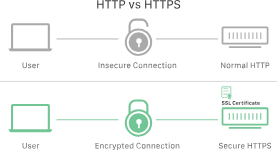
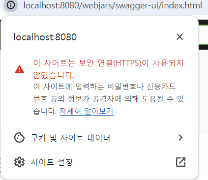
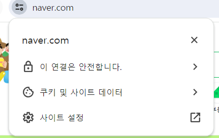
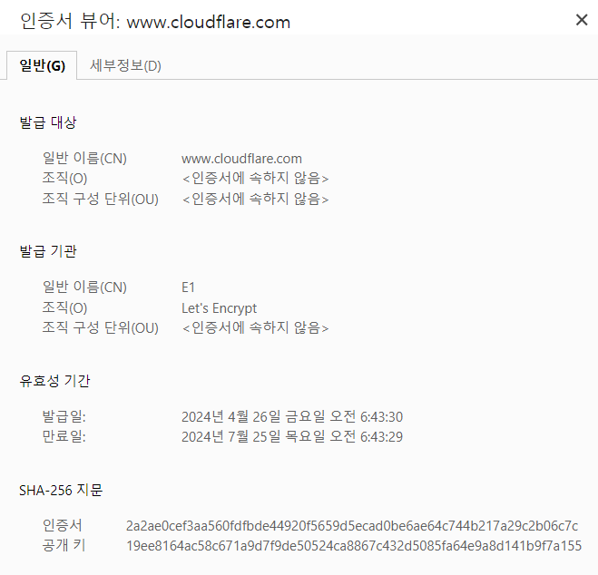

# TLS(Transport Layer Security)

<aside>
💡 TLS를 구현하는 것은 안전한 웹 앱을 구축하기 위한 표준 관행

  

</aside>

# 대칭/비대칭 암호화

암호화 통신에는 데이**터**를 암호화하는 발신자, 암호를 해독하는 수신자가 존재함

 

### 비대칭 암호화(공개키 암호화)

- 발신자가 수신자가 서로 다른 두 개의 키를 사용하는 방식
    - 양쪽에서 서로 다른 암호화를 사용
    - 서로 다른 두 개의 키로 데이터를 암호화하거나 서명하고 그 중 하나인 공개 키를 누구나 사용할 수 있도록 하는 방식
- 공개키-개인 키 쌍을 사용하며, **공개 키로 암호화된 데이터를 개인 키로 해독**
- 공개키 암호화는 인터넷 보안을 위한 중요한 기술! TLS/SSL 에 널리 사용됨
    - TLS에서 클라이언트는 웹 사이트의 TLS 인증서(또는 [SSL 인증서](https://www.cloudflare.com/learning/ssl/what-is-an-ssl-certificate/))에서 웹 사이트의 공개 키를 가져와 이를 사용하여 보안 통신을 시작함. (웹 사이트에서는 개인 키가 비밀로 유지됨)

 

### **대칭 암호화**

- 대칭 암호화에서는 동일한 하나의 키로 데이터를 암호화하고 해독함
- 대칭 암호화가 작동하려면 두 명 이상의 통신 당사자가 키가 무엇인지 알고 있어야 하며, 보안을 유지하려면 제3자가 키를 추측하거나 도용할 수 없어야 함

 

# **비대칭 암호화와 대칭 암호화는 TLS/SSL에 어떻게 사용되나?**

- TLS는 네트워크를 통한 통신을 암호화하는 프로토콜
- TLS는 비대칭 암호화와 대칭 암호화를 모두 사용함
- 공개적으로 공유되는 웹사이트의 SSL/TLS 인증서에는 공개 키가 포함됨
    - 개인 키는 원본 서버에 설치되어 있으며, 이 서버는 웹사이트에서 소유

 

### 1. TLS handshake - 공개 키 암호화

- TLS handshake에서 공개 키 암호화를 사용하여 원본 서버의 신원을 인증하고 세션 키를 생성하는 데 사용되는 데이터를 교환함
    - 클라이언트와 서버는 대칭 암호화에 사용할 세션 키에 합의
    - 양측이 세션 키를 생성하는 동안 보안을 위해 비대칭 암호화를 사용하고 웹 사이트의 원본 서버의 신원을 인증
- RSA, Diffie-Hellman 등의 키 교환 알고리즘은 공개-개인 키 쌍을 사용하여 세션 키에 합의
    - 합의된 세션 키는 handshake가 완료되면 대칭 암호화를 위해 사용됨
- 각각의 새로운 통신 세션은 새로운 TLS 핸드셰이크로 시작하고 새로운 세션 키를 사용/새로운 세션 키에 합의
    - 악의적인 공격자가 이전 세션에서 세션 키 중 하나를 식별하거나 도용해도 통신을 해독할 수 없음

 

### 2. 대칭 암호화

- TLS handshake를 통해 생성한 세션 키로 대칭 암호화
- 세션 키는 TLS 핸드셰이크 이후의 모든 통신을 암호화 & 해독함

 

# SSL(Secure Sockets Layer)

- 암호화 기반 인터넷 보안 프로토콜
    - 개인정보 보호, 인증, 무결성을 인터넷 통신에 제공
- Netscape가 1995년 처음으로 개발함
- SSL/TLS를 사용하는 웹사이트는 HTTPS가 있음
    - 주 사용사례: 클라이언트 - 서버간 통신 보호
    - 보호되지 않은 네트워크를 통한 이메일, VoIP, 기타 통신을 보호하는 데에도 사용가능
- SSL은 여러 번 개선되어 매번 성능이 개선되었고, 1999년에 TLS로 업데이트됨

 

# TLS(Transport Layer Security)

- TLS 전송계층보안은 인터넷 상의 커뮤니케이션을 위한 개인 정보와 데이터 보안을 용이하게 하기 위해 설계되어 널리 채택된 보안 프로토콜
    - TLS의 주요 사용 사례는 웹 사이트를 로드하는 웹 브라우저와 같이 웹 응용 프로그램과 서버 간의 커뮤니케이션을 암호화 하는 것
- 국제 표준 기구인 IETF에 의해 제안됨
- TLS는 Netscape가 개발한 SSL(Secure Sockets Layer) 암호화 프로토콜에서 발전한 것
    - 발표전에 이름이 변경됨
        - IETF가 업데이트 개발하고 Netscape는 더이상 참여 x 이름이 바뀌었다
        - 걍 소유권 변경 나타내는거
    - TLS와 SSL은 가끔 서로 용어가 바뀌어서 사용됨. 그냥 버전차이임 ㅇㅇ
- HTTPS는 HTTP 프로토콜 상위에서 TLS암호화를 구현한 것
    - HTTPS를 사용하는 웹사이트는 TLS암호화를 사용함

 

### +) SSL은 사라진다

- 1996년 SSL 3.0이후 업데이트 되지 않음. 앞으로 사라지게 될 것으로 여겨짐
    - 알려진 취약점 여러 가지 있음
    - 보안 전문가들은 SSL의 사용을 중단할 것을 권장
    - 최신 웹브라우저는 SSL 지원 안함
- 현재 SSL제공 업체 → 사실 상 TLS 보호를 제공하는 것
- 용어의 혼동이 있을 수 있음

 

# SSL/TLS가 중요한 이유

- TLS 프로토콜은 암호화, 인증, 무결성이라는 주요 요소를 달성
    - 암호화: 제 3자로부터 전송되는 데이터를 숨김
    - 인증: 정보를 교환하는 당사자가 요청된 당사자임을 보장
    - 무결성: 데이터가 위조되거나 변조되지 않았는지 확인
- 원래 웹 상의 데이터는 메시지를 가로채면 누구나 읽을 수 있는 일반 텍스트 형태로 전송됨
    - 고객이 소핑 웹사이트 접속, 신용카드 번호 입력하면 해당 번호가 숨겨지지 않고 인터넷을 이동
    - SSL은 이 문제를 바로잡고, 사용자 개인정보를 보호하기 위해 제작됨
    - 사용자와 웹 서버 사이를 이동하는 모든 데이터는 암호화됨 → 데이터를 가로채도 해석 불가능
- 특정 유형의 사이버 공격도 차단함
    - 웹서버를 인증하기 때문에 공격자들이 사용자를 속여 가짜 웹사이트로 데이터 훔치는 걸 막을 수 있음
    - 공격자가 전송 중인 데이터를 조작하지 못하게 막기도 함
- 오늘날 TLS로 보호되는 HTTPS는 웹 사이트의 표준 관행

 

# TLS인증/ SSL인증서란?

- 웹 사이트나 응용 프로그램이 TLS를 사용하기 위해서는 원본 서버에 TLS인증서가 설치되어 있어야함 (=SSL인증서)
    - SSL은 SSL인증서가 있는 웹사이트만 실행가능( SSL 인증서가 없으면 웹 사이트의 트래픽을 TLS로 암호화할 수 없음)
    - SSL 인증서는 신분증과 같은 역할
    - 웹사이트나 애플리케이션 서버가 웹에 저장하고 표시함
- 인증기관이 도메인을 소유한 사람 혹은 비즈니스에게 TLS인증서를 발행함
- TLS 인증서는
    - 웹 사이트의 [원본 서버](https://www.cloudflare.com/learning/cdn/glossary/origin-server/)에서 호스팅되는 데이터 파일
    - 공개 키와 웹 사이트 소유자의 신원 및 기타 정보가 포함된 데이터 파일일 뿐
    - 서버의 공개 키와 더불어 누가 도메인 소유자인지에 대한 중요한 정보를 포함함
        - 서버의 신원을 확인하는데 중요!
- 인증서는 웹사이트의 원본 서버에서 호스팅되며, 웹사이트 로드를 요청하는 모든 장치로 전송됩니다. 대부분의 브라우저에서는 사용자가 SSL 인증서를 볼 수 있습니다. Chrome의 경우 URL 표시줄 왼쪽에 있는 자물쇠 아이콘을 클릭하면 됨
- SSL인증서에 포함된 내용
    - 인증서가 발급된 대상 [도메인 이름](https://www.cloudflare.com/learning/dns/glossary/what-is-a-domain-name/)
    - 발급받은 사람, 조직, 장치
    - 발급한 인증 기관
    - 인증 기관의 디지털 서명
    - 관련 하위 도메인
    - 인증서 발급 날짜
    - 인증서 만료 날짜
    - 공개 키(개인 키는 비밀로 유지됨)
- SSL 인증서에 포함된 웹 사이트의 **공개 키**로 암호화와 인증 가능
    - 공개 키를 얻고 서버의 신원 확인가능
    - 사용자 장치는 공개 키를 보고 이를 이용해 웹 서버와 안전한 암호화 키를 수립
- CA(인증기관)은 SSL인증서 발행을 담당
    - CA는 SSL 인증서를 생성하고 제공하는 신뢰할 수 있는 제3자 외부 조직
    - SSL 인증서가 유효하려면 도메인이 인증 기관(CA)에서 인증서를 발급받아야 함
    - CA는 자체 개인 키로 인증서에 디지털 서명하므로 클라이언트 장치에서 인증서를 확인할 수 있음
    - 인증서가 발급되면 웹 사이트의 원본 서버에 설치하고 활성화해야 함/ 원본 서버에서 활성화되면 웹 사이트가 HTTPS를 통해 로드될 수 있으며, 웹 사이트와 주고받는 모든 트래픽이 암호화되어 안전하게 보호됨

+) 기술적으로, 모든 웹 사이트 소유자는 자체 SSL 인증서를 만들 수 있으며, 이러한 인증서를 자체 서명 인증서라고 함. 그러나 브라우저는 자체 서명된 인증서를 인증 기관에서 발급한 SSL 인증서만큼 신뢰할 수 있는 것으로 간주하지 않음/  디지털 서명이 CA가 아닌 웹 사이트의 자체 개인 키 사용/자체 서명된 인증서를 사용하면 원본 서버가 자신이 주장하는 서버인지 확인할 수 있는 외부 기관이 없음/ 자체 서명된 인증서가 있는 사이트는 https:// URL에도 불구하고 "안전하지 않음" 으로 표시될 수 있음 

 

### SSL 인증서 받는 법

- 웹 사이트 소유자는 인증 기관에서 SSL 인증서를 발급받은 다음 웹 서버에 설치(이 과정은 웹 호스트가 처리하는 경우가 많음)
- 인증 기관은 웹 사이트 소유자가 자신이 주장하는 당사자가 맞는지 확인할 수 있는 외부 당사자입니다. 인증 기관에서는 발급한 인증서의 사본을 보관함

 

# SSL 인증서 유형

- 하나의 인증서가 하나의 웹사이트에 적용되는지, 여러 개의 웹사이트에 적용되는지에 따라 유형이 달라짐
    - **단일 도메인:** 단일 도메인 SSL 인증서는 단 하나의 도메인("도메인"은 www.cloudflare.com처럼 웹사이트 이름입니다)에 적용됩니다.
    - **와일드카드:** 와일드카드 SSL 인증서도 단일 도메인 인증서처럼 단 하나의 도메인에 적용되지만, 도메인의 하위 도메인도 포함합니다. 예를 들어, 와일드카드 인증서는 www.cloudflare.com, blog.cloudflare.com, developers.cloudflare.com을 포함할 수 있지만, 단일 도메인 인증서는 첫 번째 도메인만 포함할 수 있습니다.
    - **멀티 도메인**: 이름이 의미하는 것처럼 멀티 도메인 SSL 인증서는 관련되지 않은 다수의 도메인에 적용될 수 있습니다.

- 또한, SSL 인증서마다 유효성 검사 수준이 다름. 유효성 검사는 신원 조회와 같은 것이며, 그 수준은 검사의 정도에 따라 다름
    - **도메인 유효성 검사:** 가장 덜 엄격하고 저렴한 수준의 유효성 검사. 기업은 도메인을 관리하고 있다는 것만 증명하면 됨.
    - **조직 유효성 검사:** 보다 실무적인 프로세스. CA가 담당자나 기업에 인증서를 직접 문의합니다. 이 인증서는 사용자에게 더 많은 신뢰를 제공.
    - **확장 유효성 검사:** 조직의 배경을 완전히 검사한 후에 SSL 인증서를 발행할 수 있음.

 

### HTTPS

- "HTTPS" 의 S는 "보안"을 의미합니다. HTTPS는 SSL/TLS가 포함된 HTTP일 뿐입니다. HTTPS 주소를 사용하는 웹 사이트에는 인증 기관에서 발급한 합법적인 SSL 인증서가 있으며, 해당 웹 사이트와 주고받는 트래픽은 SSL/TLS 프로토콜로 인증되고 암호화됨.
- 인터넷 전체가 보다 안전한 HTTPS로 전환하도록 장려하기 위해 많은 웹 브라우저에서 HTTP 웹 사이트를 "보안이 보장되지 않음" 또는 "안전하지 않음"으로 표시하기 시작했습니다. 따라서 HTTPS는 사용자와 사용자 데이터를 안전하게 보호하는 데 필수적일 뿐만 아니라 사용자와의 신뢰를 구축하는 데도 필수적인 요소가 되었습니다.

 

# SSL/TLS 작동 방식

- SSL은 높은 수준의 개인정보 보호를 제공하기 위해 웹에서 전송되는 데이터를 암호화함
    - 데이터를 가로채도 해독할 수 없는 복잡한 문자만 보게 됨
- 사용자가 웹 페이지에 연결하면 웹 페이지에서 보안 세션을 시작하는 데 필요한 공개키가 포함된 SSL 인증서를 전송
- 그 다음 클라이언트와 서버가 보안 연결을 설정하는 데 사용되는 일련의 주고받는 통신인 SSL/TLS 핸드셰이크 프로세스 시작
    - TLS 연결은 TLS Handshake로 초기화됨
    - 보안 연결 & 공개 키를 교환
    - 사용자가 TLS를 사용하는 웹사이트를 돌아다니면 사용자 장치와 웹 서버 간 TLS Handshake 시작됨
- 데이터 무결성을 제공하기 위해 데이터에 디지털 서명하여 데이터가 의도된 수신자에 도착하기 전에 조작되지 않았다는 걸 확인함

 

### TLS 핸드셰이크 발생 시점

- 사용자가 HTTPS를 통해 웹 사이트를 탐색하고 브라우저가 처음 웹 사이트의 원본 서버를 쿼리하기 시작할 때마다 발생
    - 다른 통신이 API호출/ HTTPS를 통한 DNS 쿼리를 포함하는 HTTPS를 사용할 때도 매번 발생함
    - TCP 연결이 TCP핸드셰이크를 통해 열린 후 TLS 핸드셰이크 발생

 

# TLS 핸드셰이크

- TLS 핸드셰이크는 비대칭 암호화를 사용

 

### 인증처리 & 약속지정

- 사용할 TLS 버전 지정(TLS 1.0, 1.2, 1.3 등)
- 사용한 암호 제품군 결정 (안전한 통신 연결을 수립하는 데 사용하는 알고리즘 세트)
    - 각 커뮤니케이션 세션을 위한 암호 제품군
    - 여러가지가 있음, 뭐 사용할지 합의하는거 필요
    - 암호 제품군은 공유된 [암호화 키](https://www.cloudflare.com/learning/ssl/what-is-a-cryptographic-key/) 또는 [세션 키](https://www.cloudflare.com/learning/ssl/what-is-a-session-key/)와 같은 세부 정보를 명시하는 알고리즘 집합으로 해당 특정 세션에 사용됨
- 서버의 TLS인증서를 사용하여 서버의 신원을 인증
    - 서버의 공개 키와 SSL 인증서 기관의 디지털 서명을 통해 서버의 ID를 인증
    - 서버 측의 당사자 또는 사용자가 상호 작용하는 웹 사이트가 실제 당사자인지 확인

 

### 세션 키 생성 & 생성된 세션 키에 합의

- 대칭 암호화를 사용하기 위한 세션 키를 생성 & 생성된 세션키에 합의
    - 세션 키는 TLS 핸드셰이크 이후의 모든 통신을 암호화 & 해독함
    - 새 세션마다 다른 세션 키가 통신을 암호화하는 데 사용됨
    - 공개 키와 개인 키를 사용하여 무작위로 생성된 데이터 교환, 무작위 데이터를 사용하여 세션키라는 암호화용 새 키를 생성함

- 메시지 인증코드(MAC)가 전송에 포함됨 → 데이터가 변경되지 않음을 보장
- TLS를 사용하면 사용자가(클릭, 양식 작성 등을 통해) 웹 사이트에 전송하는 [HTTP](https://www.cloudflare.com/learning/ddos/glossary/hypertext-transfer-protocol-http/) 데이터와 웹 사이트가 사용자에게 전송하는 HTTP 데이터가 모두 암호화됨
    - 암호화된 데이터는 수신자가 키를 사용하여 해독

 

### 세션 키를 사용한 대칭 암호화

- 대칭 암호화에서는 대화에 참여하는 두 당사자가 동일한 키 사용
- TLS 핸드셰이크가 끝나면 양쪽 모두 동일한 세션 키를 사용하여 암호화함
- 세션 키가 사용되면 공개 키와 개인 키는 더 이상 사용되지 않습니다. 세션 키는 세션이 종료되면 다시 사용되지 않는 임시 키
- 다음 세션을 위하여 새로운 무작위 세션 키 세트가 생성됩니다.

 

### 원본 서버 인증

데이터카 암호화되고 인증되고 나면, 메시지 인증 코드(MAC)와 함께 서명됨

서버의 TLS 통신에는 메시지 인증 코드(MAC)가 포함되며, 이는 통신이 실제 웹 사이트로부터 시작되었음을 확인하는 디지털 서명입니다.

- 이렇게 하면 서버가 인증되어 [경로상 공격](https://www.cloudflare.com/learning/security/threats/on-path-attack/)과 도메인 스푸핑을 방지할 수 있습니다.
    - 경로상 공격자는 두 장치(주로 웹 브라우저와 [웹 서버](https://www.cloudflare.com/learning/cdn/glossary/origin-server/)) 사이에 자신을 배치하고 두 장치 간의 통신을 가로채거나 수정합니다. 그러면 공격자는 정보를 수집하고 두 장치 중 하나라고 가장할 수 있음
- 또한 전송 중에 데이터가 변경되지 않도록 보장됨

수신자는 데이터의 무결성을 보장하기 위해 MAC를 확인할 수 있습니다. 이는 일종의 부정 조작 방지 포장과 같은 

 

# TLS 핸드셰이크 단계

- TLS 핸드셰이크는 클라이언트와 서버가 교환하는 일련의 데이터그램, 즉 메시지
    - 여러 단계를 통해 클라이언트와 서버는 핸드셰이크를 완료하고 추가 대화를 가능하게 하는 데 필요한 정보를 교환함
    - TLS 핸드셰이크의 정확한 단계는 사용되는 키 교환 알고리즘의 종류와 양측에서 지원하는 암호 모음에 따라 달라짐

 

### RSA 키 교환 알고리즘 TLS Handshake

- RSA 키 교환 알고리즘은 지금은 안전하지 않은 것으로 간주되지만, 1.3 이전 버전의 TLS에서 사용됨
- 과정
    1. **'클라이언트 헬로' 메시지:** 클라이언트가 서버로 "헬로" 메시지를 전송하면서 핸드셰이크를 개시합니다. 이 메시지에는 클라이언트가 지원하는 TLS 버전, 지원되는 암호 제품군, 그리고 "클라이언트 무작위"라고 하는 무작위 바이트 문자열이 포함됩니다.
    2. **'서버 헬로' 메시지:** 클라이언트 헬로 메시지에 대한 응답으로 서버가 서버의 [SSL 인증서](https://www.cloudflare.com/learning/ssl/what-is-an-ssl-certificate/), 서버에서 선택한 암호 제품군, 그리고 서버에서 생성한 또 다른 무작위 바이트 문자열인 "서버 무작위"를 포함하는 메시지를 전송
    3. **인증:** 클라이언트가 서버의 SSL 인증서를 인증서 발행 기관을 통해 검증합니다. 이를 통해 서버가 인증서에 명시된 서버인지, 그리고 클라이언트가 상호작용 중인 서버가 실제 해당 도메인의 소유자인지를 확인합니다.
    4. **예비 마스터 암호:** 클라이언트가 "예비 마스터 암호"라고 하는 무작위 바이트 문자열을 하나 더 전송합니다. 예비 마스터 암호는 공개 키로 암호화되어 있으며, 서버가 개인 키로만 해독할 수 있습니다. (클라이언트는 서버의 SSL 인증서를 통해 [공개 키](https://www.cloudflare.com/learning/ssl/how-does-public-key-encryption-work/)를 받습니다.)
    5. **개인 키 사용:** 서버가 예비 마스터 암호를 해독합니다.
    6. **세션 키 생성:** 클라이언트와 서버가 모두 클라이언트 무작위, 서버 무작위, 예비 마스터 암호를 이용해 세션 키를 생성합니다. 모두 같은 결과가 나와야 합니다.
    7. **클라이언트 준비 완료:** 클라이언트가 세션 키로 암호화된 "완료" 메시지를 전송합니다.
    8. **서버 준비 완료:** 서버가 세션 키로 암호화된 "완료" 메시지를 전송합니다.
    9. **안전한 대칭 암호화 성공:** 핸드셰이크가 완료되고, 세션 키를 이용해 통신이 계속 진행됩니다.

 

### 임시 Diffie-Hellman TLS Handshake

- 모든 TLS 핸드셰이크가 비대칭 암호화(공개 키와 개인 키)를 사용하지만, 세션 키를 생성하는 과정에서 모두가 개인 키를 사용하는 것은 아님
- 과정
    1. **클라이언트 헬로:** 클라이언트가 프로토콜 버전, 클라이언트 무작위, 암호 제품군 목록을 포함하는 클라이언트 헬로 메시지를 전송합니다.
    2. **서버 헬로:** 서버가 SSL 인증서, 선택한 암호 제품군, 서버 무작위를 포함하는 응답을 전송합니다. 위에 설명한 RSA 핸드셰이크와 달리, 서버는 이 메시지에 다음 내용도 포함합니다(단계 3).
    3. **서버의 디지털 서명:** 서버에서는 이 시점까지의 모든 메시지에 대한 디지털 서명을 계산합니다.
    4. **디지털 서명 확인:** 클라이언트는 서버의 디지털 서명을 확인하여 서버가 자칭하는 사람이 맞는지 확인합니다.
    5. **클라이언트 DH 매개변수:** 클라이언트가 DH 매개변수를 서버로 전송합니다.
    6. **클라이언트와 서버가 예비 마스터 암호를 계산:** RSA 핸드셰이크의 경우에서처럼 클라이언트가 예비 마스터 암호를 생성하여 서버로 전송하는 대신, 클라이언트와 서버가 서로 교환한 DH 매개변수를 사용하여 일치하는 예비 마스터 암호를 별도로 계산합니다.
    7. **세션 키 생성:** 이제 클라이언트와 서버가 RSA 핸드셰이크에서와 마찬가지로 예비 마스터 암호, 클라이언트 무작위, 서버 무작위를 사용하여 세션 키를 계산합니다.
    8. **클라이언트 준비 완료:** RSA 핸드셰이크와 동일합니다.
    9. **서버 준비 완료**
    10. **안전한 대칭 암호화 성공**

- DH 매개변수: DH는 Diffie-Hellman을 의미. Diffie-Hellman 알고리즘은 지수 계산을 이용해 동일한 예비 마스터 암호를 생성. 서버와 클라이언트가 각자 계산을 위한 매개변수를 제공하고, 각자 서로 다른 계산 결과가 나오지만, 합치면 결과가 동일해짐.
    - 자세한 내용은 [Keyless SSL이란 무엇일까요?](https://www.cloudflare.com/learning/ssl/keyless-ssl/)를 참고

 

### TLS 1.3 HandShake ★

- TLS 1.3은 RSA나 공격에 취약한 기타 암호 제품군 및 매개변수를 지원하지 않음
- 또한 TLS 핸드셰이크가 단축되어 TLS 1.3 핸드셰이크가 더 빠르고 안전해짐
- TLS 1.3 핸드셰이크의 기본 단계
    - **클라이언트 헬로(client hello):** 클라이언트는 프로토콜 버전, 클라이언트 무작위, 암호 모음 목록이 포함된 클라이언트 헬로 메시지를 보냅니다.안전하지 않은 암호 모음에 대한 지원이 TLS 1.3에서 제거되었으므로 사용 가능한 암호 모음의 수가 크게 줄었습니다.클라이언트 헬로에는 예비 마스터 암호를 계산하는 데 사용되는 매개변수도 포함되어 있습니다.기본적으로 클라이언트는 서버가 선호하는 키 교환 방법을 알고 있다고 가정합니다(단순화된 암호 제품군 목록으로 인해 아마도 알고 있을 것입니다).이렇게 하면 핸드셰이크의 전체 길이가 줄어드는데, 이는 TLS 1.3 핸드셰이크와 TLS 1.0, 1.1, 1.2 핸드셰이크의 중요한 차이점 중 하나입니다.
    - **서버가 마스터 암호를 생성:** 이 시점에서 서버는 클라이언트 무작위, 클라이언트의 매개변수, 암호 그룹을 받았습니다.서버는 이미 서버 무작위를 자체적으로 생성할 수 있으므로 이미 서버 무작위를 보유하고 있습니다.따라서 서버는 마스터 암호를 생성할 수 있습니다.
    - **서버 헬로(server hello) 및 "완료됨":** 서버 헬로에는 서버의 인증서, 디지털 서명, 서버 무작위, 선택한 암호 그룹이 포함됩니다.서버는 이미 마스터 암호를 가지고 있으므로 "완료됨" 메시지도 전송합니다.
    - **마지막 단계 및 클라이언트 "완료됨":** 클라이언트가 서명 및 인증서를 확인하고 마스터 암호를 생성한 후 "완료됨" 메시지를 전송합니다.
    - **안전한 대칭 암호화 성공**

 

**세션 재개를 위한 0-RTT 모드**

- TLS 1.3은 클라이언트와 서버 간의 왕복 또는 주고받는 통신이 전혀 필요 없는 더욱 빠른 버전의 TLS 핸드셰이크를 지원함
- 클라이언트와 서버가 이전에 서로 연결된 적이 있는 경우(예: 사용자가 이전에 웹 사이트를 방문한 적이 있는 경우) 첫 번째 세션에서 "재개 주 암호"라고 하는 또 다른 공유 암호를 각각 도출할 수 있음
- 또한 서버에서는 이 첫 번째 세션 중에 세션 티켓이라고 불리는 것을 클라이언트에게 보냄
    - 클라이언트는 이 공유 암호를 사용하여 다음 세션의 첫 번째 메시지에서 해당 세션 티켓과 함께 암호화된 데이터를 서버로 전송할 수 있음
- 그리고 클라이언트와 서버 간에 TLS가 재개됨.

 

# TLS와 웹 응용 프로그램의 성능

- TLS의 최신버전은 웹 응용 프로그램 성능에 거의 영향을 미치지 않음
- TLS 연결을 설정하는 데 수반되는 복잡한 프로세스 때문에 로드 시간과 계산 능력이 모두 소모되어야함
    - 데이터가 전송되기 전 클라이언트와 서버 모두를 위한 메모리뿐만 아니라 로딩 시간도 소모
- TLS Handshake가 생성한 잠재적인 지연을 완화하는 것을 돕는 기술
    1. TLS False Start: TLS Handshake가 완료되기 전에 서버와 클라이언트 데이터 전송을 시작하도록 하는 것
    2. TLS Session Resumption: 이전에 커뮤니케이션한 적 있는 서버와 클라이언트가 간략화된 HandShake를 사용하도록 허용하는 것
- 얘네 덕에 TLS가 성능에 거의 영향 안미침
    - TLS와 연관된 계산 비용은 오늘날 표준에 따르면 거의 무시해도 좋은 정도임
- 2018년에 발표된 TLS 1.3은 더 빨라짐
    - TLS Handshake는 몇 밀리세컨드로 프로세스를 단축하며, 1회 왕복만 요구함
    - 사용자가 전에 웹 사이트에 연결한 적이 있으면 TLS Handshake는 0회 왕복가능 (속도 더 좋아짐)

 

# HTTPS란

- 웹 브라우저와 웹 사이트 간에 데이터를 전송하는 데 사용되는 기본 프로토콜인 HTTP의 보안버전
    - HTTP프로토콜 + TLS/SSL 암호화
- 데이터 전송의 보안을 강화하기 위해 암호화됨
- 모든 웹 사이트, 특히 로그인 자격 증명이 필요한 웹사이트는 HTTPS를 이용해야함

- HTTPS는 암호화 프로토콜을 사용하여 통신을 암호화함
    - TLS 프로토콜
    - 비대칭 공개 키를 사용하여 통신을 보호함(2개의 서로 다른 키 사용)

HTTP는 도청이 매우 취약함

- HTTP를 통해 발생하는 모든 통신은 일반 텍스트로 이루어짐 → 누구나 쉽게 접근가능, 경로사 공격에 취약함
- 공용 wi-fi를 사용한 통신은 도청에 매우 취약
- http를 사용한다면 인터넷 서비스 공급자(ISP) 또는 기타 중개자가 웹 사이트 소유자의 승인 없이 웹 페이지에 콘텐츠를 삽입할 수 있습니다. 이는 일반적으로 광고의 형태로 이루어지며, 수익을 늘리고자 하는 ISP가 고객의 웹 페이지에 유료 광고를 삽입합니다. 당연히 이러한 경우 광고 수익과 광고의 품질 관리는 웹 사이트 소유자와 공유되지 않습니다. HTTPS에서는 조정을 거치지 않은 제3자가 웹 콘텐츠에 광고를 삽입하는 기능이 제거됩니다.
- HTTPS를 사용하면 트래픽이 암호화되므로 패킷을 스니핑하거나 가로챈다고 해도 무의미한 문자로만 인식됨

 

### HTTPS에서 사용하는 포트

- 443 포트

 

# 참고자료

[TLS란? | 네트워크 보안 프로토콜 | Cloudflare](https://www.cloudflare.com/ko-kr/learning/ssl/transport-layer-security-tls/)

[SSL 보안을 위한 SSL 인증서 | Cloudflare](https://www.cloudflare.com/ko-kr/learning/ssl/what-is-ssl/)

[공개 키 암호화는 어떻게 작동할까요? | 공개 키 암호화 및 SSL | Cloudflare](https://www.cloudflare.com/ko-kr/learning/ssl/how-does-public-key-encryption-work/)

[비대칭 암호화란? | 비대칭 암호화와 대칭 암호화의 비교 | Cloudflare](https://www.cloudflare.com/ko-kr/learning/ssl/what-is-asymmetric-encryption/)

[TLS 핸드셰이크란? | 세션키 교환 | Cloudflare](https://www.cloudflare.com/ko-kr/learning/ssl/what-happens-in-a-tls-handshake/)

[SSL의 작동 방식은? | SSL 인증서와 TLS | Cloudflare](https://www.cloudflare.com/ko-kr/learning/ssl/how-does-ssl-work/)

[HTTPS란 무엇입니까? | Cloudflare](https://www.cloudflare.com/ko-kr/learning/ssl/what-is-https/)

[SSL 인증서란? | 무료 SSL인증서 | Cloudflare](https://www.cloudflare.com/ko-kr/learning/ssl/what-is-an-ssl-certificate/)

 

# 더 알아볼 것

[Keyless SSL의 작동 원리는 무엇일까요? | FS(Forward Secrecy, 순방향 비밀성) | Cloudflare](https://www.cloudflare.com/ko-kr/learning/ssl/keyless-ssl/)

[HTTPS를 사용하는 이유는 무엇입니까? | Cloudflare](https://www.cloudflare.com/ko-kr/learning/ssl/why-use-https/)

[Luavis' Dev Story - 알아두면 쓸데없는 신비한 TLS 1.3](https://luavis.me/server/tls-1.3)

[암호화 키란? | 키와 SSL 암호화 | Cloudflare](https://www.cloudflare.com/ko-kr/learning/ssl/what-is-a-cryptographic-key/)

[SSL/TLS, Cipher suite란?](https://run-it.tistory.com/30)

[경로상 공격자란? | Cloudflare](https://www.cloudflare.com/ko-kr/learning/security/threats/on-path-attack/)

 

- CA, 해싱 알고리즘, 사이퍼슈트 나와야함
- 생활코딩 TLS