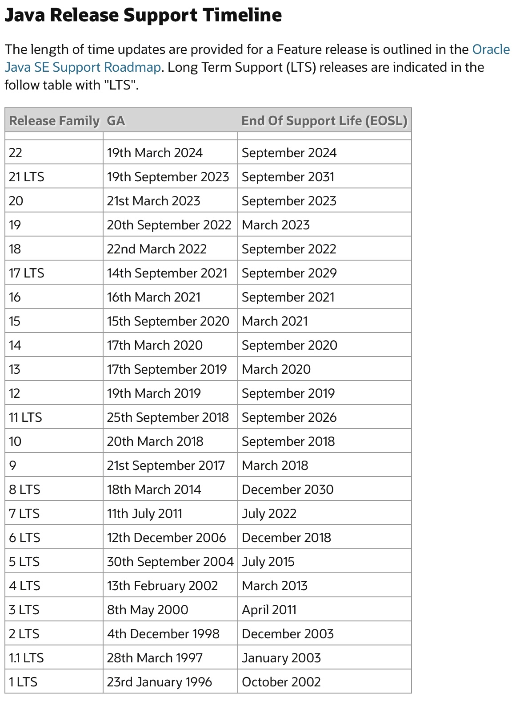
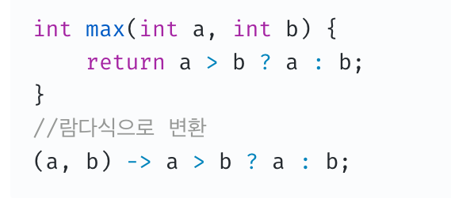
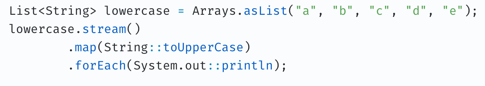
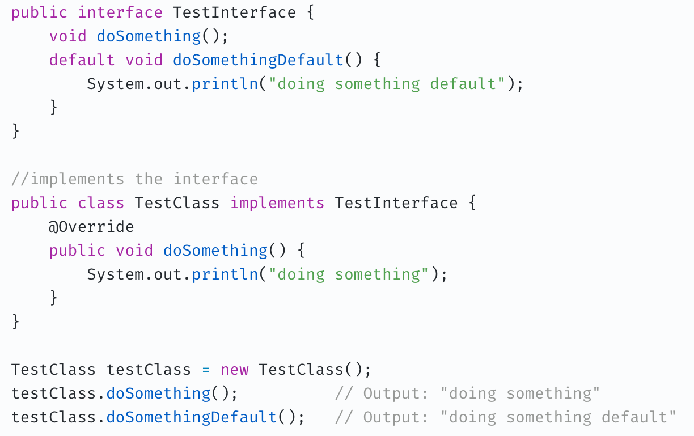
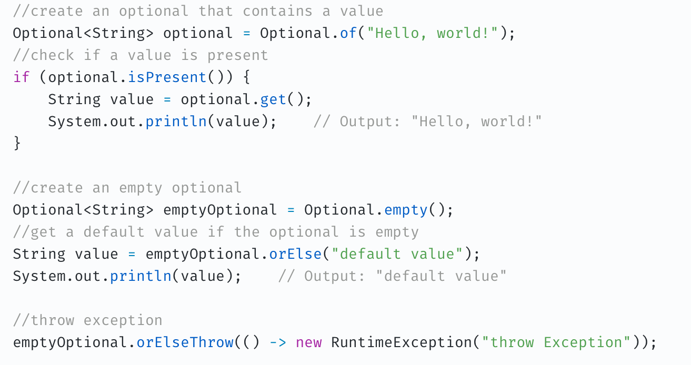
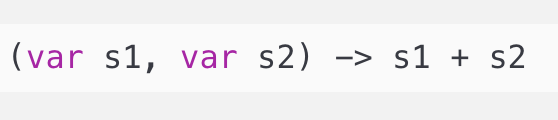
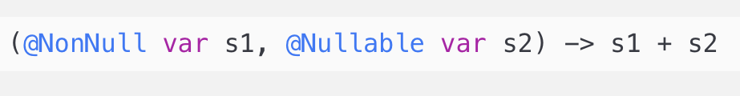
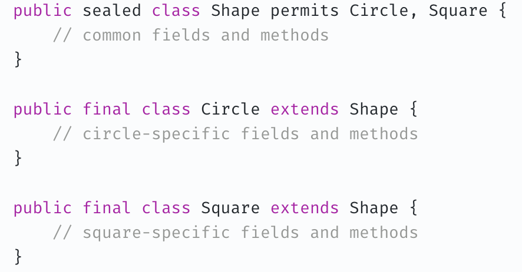
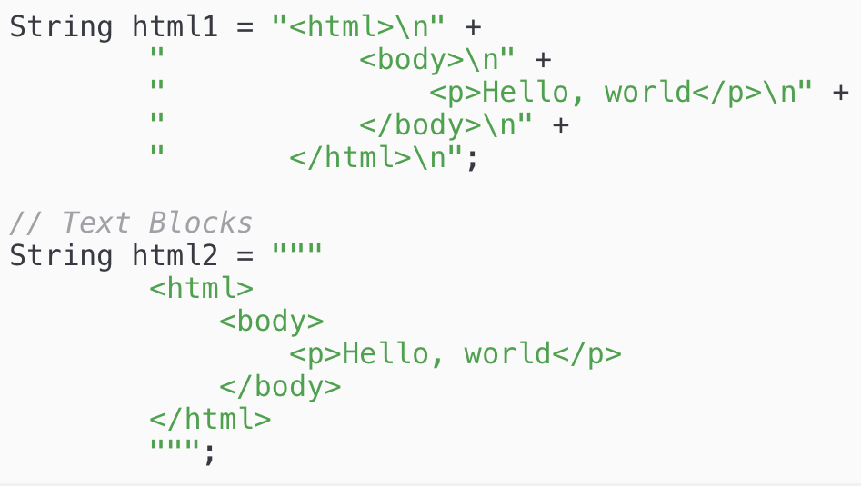

# Java 버전

## 자바 버전?

https://www.java.com/releases/
-> 여기서 자바버전에 대한 내용을 확인할 수 있다.

위와 같이 자바에는 여러가지 버전이 있지만 8,11,17버전이 가장 많이 쓰이고있다.
=> 그이유는 해당 버전들이 <strong>LTS</strong> 이기 때문.

- <strong>LTS?</strong>
  Long Term Support의 약자로 출시 후 8년이라는 긴 기간을 보완 업데이트와 버그 수정을 지원하는 버전이라는 뜻. 안정적으로 java를 사용하고 싶다면 LTS버전을 사용하자

| java 버전 | 지원기간 |
| --------- | -------- |
| java 8    | ~2030.12 |
| java 11   | ~2026.9  |
| java 17   | ~2029.9  |
| java 21   | ~2031.9  |

자바 8,11,17의 지원기간을 확인해보면 8이 지원기간이 젤 긺
때문에 지원기간 + 기존 서비스와의 호환성 등 여러 이유로 자바 11이 나왔을 때 8에서 11로 이동이 많진 않았음
하지만 17출시 이후 8에서 17로 전환율은 높았는데 그 이유는 string boot 3.0에서 java최소 버전으로 17이상을 사용해야 한다고 명시되어 있기 때문이라 생각됨.

 

## 버전별 차이

## Java 8

- oracle이 sun microsystems 인수 후 출시한 첫 번째 LTS버전의 자바
- 32bit를 지원하는 마지막 공식 java버전
- oracle사에서 지원하는 유료버전인 oracle JDK와 오픈소스 기반의 무료버전인 open JDK로 나뉨
- new data and time API(localDataTime 등)
- Lambda, stream API
- Static Link JNI Library
- unsinged Integer 계산
- Annotation an java types
- Interface Default Method
- optional class
- Nashorn JavaScript engine 탑재

### lambda

람다는 함수를 간단한 식으로 표현하는 방법

### stream API

컬렉션의 저장요소를 하나씩 순회하면서 처리할 수 있는 코드 패턴

### interface default method

java8이전에는 인터페이스는 메서드 정의만 가능하고 구현은 할 수 없었다.
default method 라는 개념이 생기면서 구현 내용도 인터페이스에 포함시킬 수 있게 됨

### optional class

optional 은 null이 올 수 있는 값을 감싸는 wrapper클래스로 참조하더라도 NPE(null point exception)가 발생하지 않도록 함

  

## Java 11

- oracle JDK와 open JDK 통합되고 oracle JDK가 구독형 유료 모델로 전환
- 람다 지역변수 사용 방법 변경
- Third party JDK로의 이전 필요
- HTTP클라이언트 표준화 기능
- 앱실론 가비지 컬랙터(epsilon GC)

### 람다 지역변수 사용방법 변경

var 키워드는 java 10에서 추가됨
=> var를 사용하는 경우 데이터 유형을 지정하지 않고 변수를 선언하고 정의할 수 있으며, 컴파일러는 할당된 데이터 유형에 따라 데이터 유형을 결정하게 됨

자바 11에서 위와 같은 구문이 지원되면서 람다 인자에 대한 타입 추론의 유연성이 추가되었으며, 람다식에 var키워드를 사용할 수 있게 되면서 아래와 같은 파라미터 어노테이션도 적용할 수 있게 됨

  

## Java 17

- 봉인 클래스(seald class) 정식 추가
- 패턴 매칭 프리뷰 단계
- Incubator (Foreign Function & memory API)
- 애플 M1 및 이후 프로세서 탑재 제품군에 대한 정식 지원
- 의사난수 생성기를 통해 예측하기 어려운 난수를 생성하는 API추가
- 컨텐츠 기반의 역직렬화 필터링
- record data class 추가

### seald class

interface는 상속하거나 구현할 클래스를 지정해두고, 해당 클래스들만 상속 또는 구현을 허용하는 키워드이다.
개발자는 seald키워드를 통해 어떤 클래스가 해당 클래스를 상속 또는 구현하는지 쉽게 알 수 있고, 제한할 수 있다.

### text blocks

""" 으로 멀티 라인 문자열을 사용할 수 있게됨

java 17이후는
https://velog.io/@dongvelop/JDK-21이-출시되었다.-최신-문법은-살펴봐야지
여기를 참고하면 좋을듯
