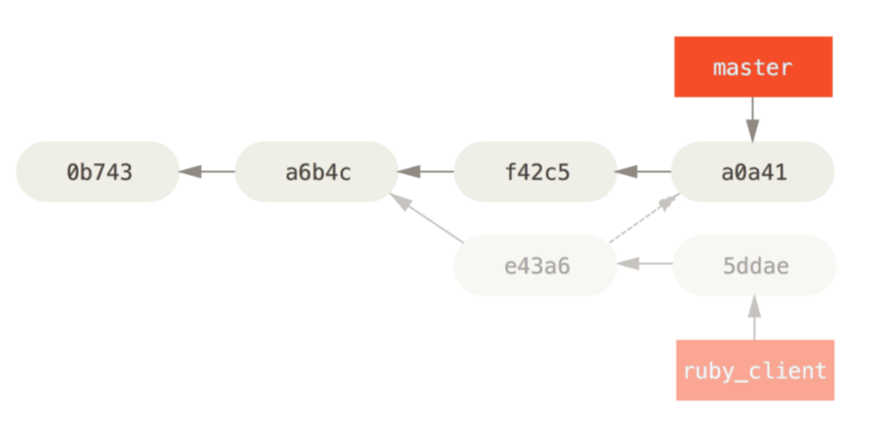

# merge, rebase, cherry-pick

## 1. merge

### merge란?

git에서 서로 다른 작업을 하기 위한 별도의 공간을 생성할 때 브랜치를 생성해서 기능을 구현한다. 기능구현이 완료되면 main브랜치에 합쳐야 하는데 이런 과정을 merge라고 한다.

### a. fast-forward

target-branch가 가리키는 커밋이 현재 branch가 가리키는 커밋의 후손일 경우 (브랜치가 두갈래로 나눠지지 않은 경우) 별도의 커밋을 생성하지 않고 브랜치의 head만 이동해 base 커밋의 브랜치로 만든다.

예를 들어 이런 브랜치에서 master브랜치에서 hotfix브랜치와 merge한다고 가정해보자

marster 브랜치에서 hotfix브랜치가 분기한 뒤 작업은 없기 때문에 fast-forward방식으로 병합돼서 master 브랜치의 head가 hotfix 브랜치의 head로 이동한다. (iss53브랜치는 master랑 머지 전이라 master브랜치는 변함 없음 )

머지 후의 브랜치는 이런 모습이 된다.

### b. 3-way-merge

아래 그림처럼 두 브랜치가 동일 선상이 아닐 때 3-way-merge가 발생한다.

merge 전

merge 후

3-way가 완료되면 그 결과를 담고있는 merge커밋이 생성된다.

### c. conflict

3-way-merge의 경우 conflict가 발생할 수 있는데 이는 개발자가 직접 수정해주어야 한다.

### merge 옵션

1. --ff
   merge의 디폴트값.
   fast forward면 새로운 커밋을 생성하지 않고 fast-forward가 아니면 merge 커밋을 생성한다.

2. --no--ff
   fast-foward 인경우에도 무조건 merge commit을 생성

3. --squash
   모든 커밋을 하나의 커밋으로 합친 뒤 merge

## 2. rebase

### rebase란?

rebase는 공통조상을 바꾸는 방식임
머지보다 깨끗한 커밋 히스토리를 만들 수 있다.

위와 같은 상황애서 experiment 브랜치에서 master브랜치를 rebase 한다고 가정하자

rebase가 실행되면

1. 공통조상(c2)로 이동한다.
2. experiment 브랜치가 가리키는 커밋(c4)까지의 diff를 임시 저장
3. experiment 브랜치를 master 브랜치가 가리키는 커밋(c3)을 가리키게 만든다.
4. 앞에서 저장해놓은 diff를 차례대로 적용

<b>rebase 후 브랜치 </b>

그리고 나서 master 브랜치를 experiment 브랜치와 fast-foward 시키면 최종적으로 merge와 동일한 결과가 나온다. 하지만 merge보다 깔끔한 히스토리를 가질수 있음

<b>최종</b>

### 요약

1. 브랜치를 합치려는 목적으로 사용
   - commit history가 merge와는 다르게 선형적으로 생성된다.
2. rebase는 현재 브랜치의 base를 바꾸는 것
   - 생성된 커밋들은 새롭게 복사되어 base가 변경됨
3. merge한 코드 결과와 rebase한 코드 결과는 같아야한다.

<b>주의사항</b>
이미 원격 장소에 올라간 커밋은 절대 rebase하면 안되고, rebase는 push 하기 전에 히스토리를 정리하는 목적으로만 사용해야한다. 
왜냐하면 rebase는 기존의 커밋을 옮기는것이 아닌 동일한 내용의 새로운 커밋을 만드는 것이기 때문에 pull을 받게 되면 새로운 커밋으로 인식되어 충돌이 발생할 수 있기떄문

## 3. cherry-pick

### a. cherry-pick 이란?
다른 브랜치 커밋을 선택적으로 내브랜치에 적용시키는 것

<b> cherry-pick 실행 전 </b>

<b>cherry-pick 실행 후 </b>

## 참고

[테코톡 오리&코린의 merge,rebase,cherry pick](https://youtu.be/b72mDco4g78?si=av1q6WmIokbNm_rS)
[merge의 종류](https://seokzin.tistory.com/entry/Git-merge의-종류-Fast-forward-3-way-merge)
[브랜치를 합치는 방법](https://seokzin.tistory.com/entry/Git-브랜치를-합치는-방법-merge-rebase-cherry-pick)
[오린과 코린의 merge, rebase, cherry-pick](https://le2ksy.tistory.com/25)
