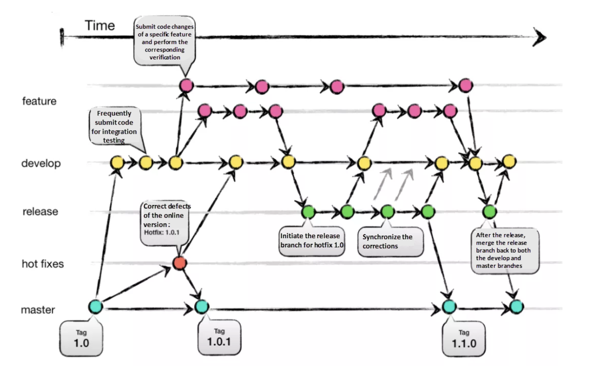
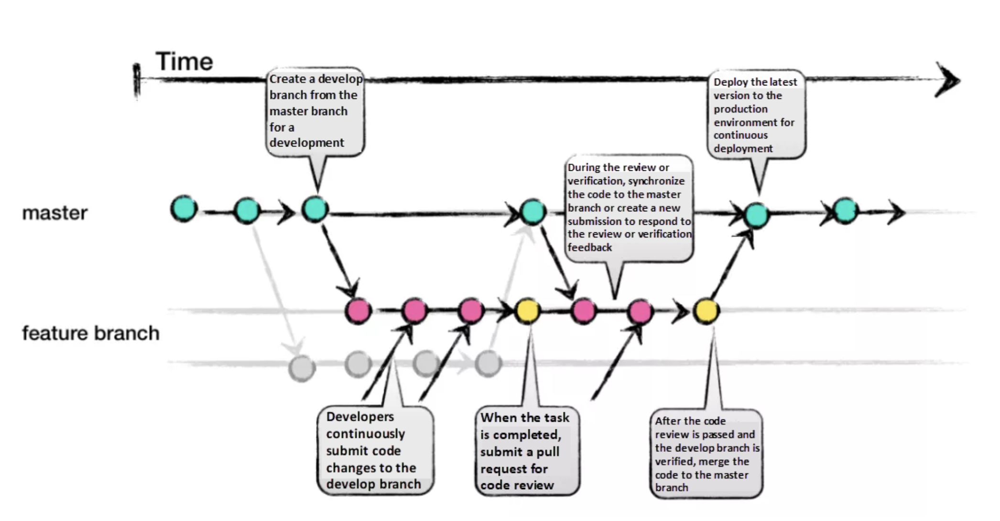

# git branch 전략

## main 브랜치만 사용할 때의 문제점

1. 내가 작업중인 파일을 누군가 건드릴 수 있다.
2. 여러 기능을 개발하며 생성된 히스토리가 메인 브랜치에 뒤죽박죽 섞이게 된다.
3. 히스토리가 섞여있어 만약 문제가 생겼을 때 원하는 시점으로 롤백하기가 어렵다.

=> 브랜치를 사용할 경우 여러 기능을 독립적인 환경에서 병렬적으로 개발할 수 있다.

## Git branch 전략

깃 브랜치 전략은 프로젝트의 깃 브랜치를 효과적으로 관리하기 위한 워크플로우이다.
대표적인 전략으로는 git Flow, github flow 가 있다.

## Git Flow

git flow는 크게 main, develop, feature, release, hotfix 브랜치로 구분하여 브랜치를 관리한다.

### main 브랜치

main 브랜치는 출시 가능한 프로덕션 코드를 모아두는 브랜치이다. main 브랜치는 프로젝트 시작 시 생성되며, 개발 프로세스 전반에 걸쳐 유지된다. 배포된 각 버전을 tag를 이용해 표시해둔다.

### develop 브랜치

다음 버전 개발을 위한 코드를 모아두는 브랜치이다. 개발이 완료되면 main으로 머지된다.

### feature 브랜치

하나의 기능을 개발하기위한 브랜치이다. develop 브랜치에 생성하며, 기능 개발이 완료되면 다시 develop브랜치로 머지된다. 머지할 때 주의점은 fast-forward로 머지하지 않고 merge commit 을 생성하여 머지해야한다.
네이밍은 feature/branch-name 과 같은 형태로 생성

### release 브랜치

소프트웨어 배포를 준비하기 위한 브랜치이다. develop 브랜치에서 생성되며 버전 이름 등 소소한 데이터를 수정하기 위해 사용된다. 배포준비가 완료되었다면 main 과 develop 브랜치에 둘다 머지한다. 이때, main브랜치에는 태그를 이용하여 버전을 표시한다.
네이밍은 release/v1.1 과 같은 형태로 생성

### hotfix 브랜치

이미 배포한 버전에 문제가 발생했다면, hotfix브랜치를 사용하여 문제를 해결한다. main 브랜치에서 생성하며, 문제해결이 완료되면 main 과 develop에 둘다 머지한다.
네이밍은 hotfix/v1.1 과 같은 형태로 생성

### git flow의 한계

웹 어플리케이션에는 적합하지 않다.
git flow는 명시적으로 버전관리가 필요한 스마트폰 어플리케이션, 오픈소스 라이브러리/ 프레임워크 등의 프레임워크에 적합하다.
웹어플리케이션의 경우 사용자는 항상 최신의 단일 버전만 사용하기 때문에 웹 개발에는 다소 적합하지않다.

## github Flow

git flow 에 비해 간단한 구조이다.

### main 브랜치

main 브랜치의 모든 커밋은 언제 배포하든 문제가 없어야하고, 언제든 브랜치를 만들어도 문제가 없어야한다.

### feature 브랜치

새로운 기능을 개발할때 main에서 생성한다. git flow의 feature과 동일한 역할을 한다.
feature 브랜치의 이름은 기능을 설명하는 명확한 이름으로 해야한다.

## 브랜치 전략 선택

개발팀이 소규모 애자일 팀이고, 제품이 단일 릴리즈 버전밖에 존재하지 않다면 github flow가 적절하다

더 자세한 내용은 https://techblog.woowahan.com/2553/ 참고
